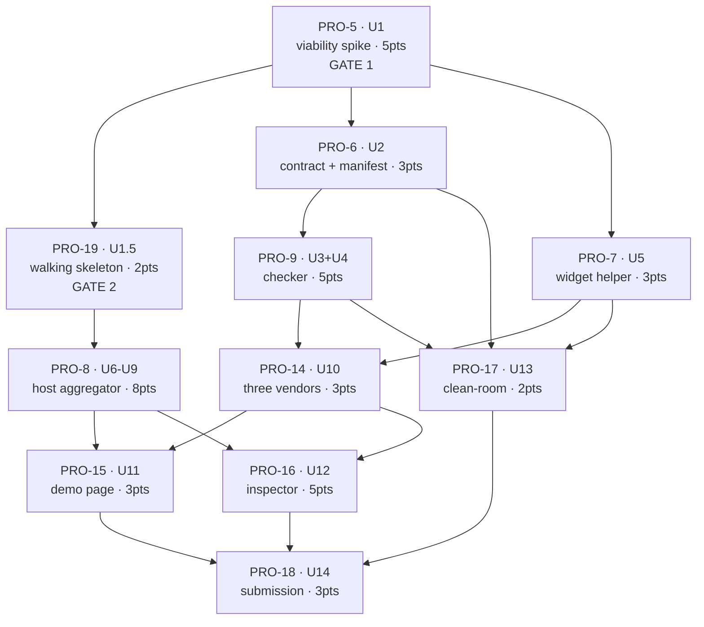

# Orchestration

**The canonical work graph.** What blocks what, what runs in parallel, what to cut and when.

- **What to build** → `docs/plans/2026-08-31-001-feat-ambient-webmcp-tool-federation-plan.md`
- **How to write it** → `CONVENTIONS.md`
- **What order to work** → this file
- **Live ticket state** → [Linear: ambient-webmcp](https://linear.app/projects-and-hackathons/project/ambient-webmcp-b0715c844823)

Linear's `blockedBy` relations mirror this graph and are authoritative for *status*. This file is authoritative for *reasoning* — why the order is what it is, and what to do when it breaks.

**Hard deadline: 2026-09-03, 13:00 PDT.**

---

## If you are an agent assigned one ticket

Read, in this order: your Linear ticket → `CONVENTIONS.md` → your unit and its cited requirements in the plan (scan headings, don't read it whole) → the "Wave" section below to see who you hand off to.

Then check whether `docs/spike-report.md` and `docs/skeleton-report.md` exist. **If they do, read them before writing code** — they carry corrections to assumptions this file and the plan were written under.

Do not merge your own PR.

## If you are running an orchestration session

1. Query Linear for issues in project `ambient-webmcp` with no unresolved blockers — that is your dispatchable set.
2. Cross-check against the wave table below; if Linear and this file disagree, Linear is right about status and this file is right about intent.
3. Dispatch by the model tier in the ticket, not uniformly.
4. Respect the concurrency ceiling in "Realistic parallelism" below. It is lower than the graph allows.

---

## Deployed origins — canonical

**These are the real hostnames. Use them verbatim** in the allowlist, in `exposedTo`, in `fromOrigins`, in origin trial tokens, and in anything shown to a judge. Anywhere else that names an origin is stale by definition; this table wins.

All four Vercel projects are live and serving production from `main` (root directory per project, auto-deploy on push). Vercel team `tomiwaalukos-projects`, hobby plan.

| Role | Origin | Vercel project | Root dir | Token |
|---|---|---|---|---|
| host | `https://ambient-host-tomiwaalukos-projects.vercel.app` | `ambient-host` | `sites/host` | ☐ not minted |
| acme | `https://acme-booking-tomiwaalukos-projects.vercel.app` | `acme-booking` | `sites/acme-booking` | ☐ not minted |
| northwind | `https://northwind-checkout-tomiwaalukos-projects.vercel.app` | `northwind-checkout` | `sites/northwind-checkout` | ☐ not minted |
| zenith | `https://zenith-support-tomiwaalukos-projects.vercel.app` | `zenith-support` | `sites/zenith-support` | ☐ not minted |

⚠️ **The short `<name>.vercel.app` form does not work for three of the four.** Those names were already taken globally, so Vercel assigned arbitrary suffixes (`-theta`, `-xi`, `-six`) — inconsistent, and only `northwind-checkout.vercel.app` got the clean form. The team-suffixed form above is the one that exists for all four, so it is canonical. Do not use the short form anywhere.

**Tokens.** Four separate **first-party** tokens, one per origin, delivered by `<meta http-equiv="origin-trial">` in that origin's own document. Iframes do not inherit the embedder's token, and `vercel.app` is on the Public Suffix List so a subdomain-matched token will not be issued. Trial `WebMCP`, id `4163014905550602241`, milestones 149–156. Self-service, immediate, no review queue. **Validity must extend past the judging window, which is after 2026-09-03.** Each `sites/*/index.html` has a commented placeholder marking where its token goes.

A separate **third-party** token also goes in the widget helper (PRO-7) — that one must be delivered from an external JS file, not a meta tag, and is what carries WebMCP onto any host embedding the widget.

## The graph

## Ticket index

| Ticket | Unit | What | Blocked by | Blocks | Est | Tier |
|---|---|---|---|---|---|---|
| PRO-5 | U1 | Viability spike, 4 origins, 6 questions | — | all | 5 | Deep |
| PRO-19 | U1.5 | Walking skeleton, disposable | PRO-5 | PRO-8 | 2 | Standard |
| PRO-6 | U2 | `CONTRACT.md` + `rules/manifest.json` | PRO-5 | PRO-9, PRO-17 | 3 | Deep |
| PRO-9 | U3+U4 | Checker: engine, CLI, own fixtures | PRO-6 | PRO-14, PRO-17 | 5 | Deep |
| PRO-7 | U5 | Widget helper + 3P token | PRO-5 | PRO-14, PRO-17 | 3 | Standard |
| PRO-14 | U10 | acme / northwind / zenith origins | PRO-7, PRO-9 | PRO-15, PRO-16 | 3 | Standard |
| PRO-8 | U6–U9 | Host aggregator (4 phases) | PRO-19 | PRO-15, PRO-16 | 8 | Deep |
| PRO-15 | U11 | Demo page + agent task path | PRO-8, PRO-14 | PRO-18 | 3 | Standard |
| PRO-16 | U12 | Inspector, revocation, a11y | PRO-8, PRO-14 | PRO-18 | 5 | Deep |
| PRO-17 | U13 | Clean-room portability | PRO-6, PRO-7, PRO-9 | PRO-18 | 2 | Standard |
| PRO-18 | U14 | README, license, write-up, video | PRO-15, PRO-16, PRO-17 | — | 3 | Light |

**Canceled and merged** — do not work these: PRO-10, PRO-12, PRO-13 → absorbed into PRO-8. PRO-11 → absorbed into PRO-9.

## File ownership

Two agents editing one file at the same time is the main avoidable conflict. Ownership is exclusive unless noted.

| Path | Owner |
|---|---|
| `sites/*/index.html`, `scripts/sync-sites.mjs` | PRO-5 creates; PRO-14 and PRO-15 extend |
| `src/shared/adapter.js` | PRO-5 |
| `src/shared/patterns.js` | PRO-9 |
| `CONTRACT.md`, `rules/manifest.json` | PRO-6 |
| `src/checker/**`, `test/fixtures/**` | PRO-9 |
| `src/widget/**` | PRO-7 (PRO-19 stubs `helper.js` first) |
| `src/host/**` | PRO-8 (PRO-19 stubs `aggregator.js`, `naming.js`, `inspector.js` first) |
| `src/host/inspector.js` | PRO-16 after PRO-8 lands |
| `sites/host/index.html`, `demo.js`, `allowlist.js` | PRO-15 |
| `CONVENTIONS.md` | Shared — PRO-19 may correct interface signatures; anyone may fix a wrong one, in its own commit |

---

## Waves

### Wave 0 — Gate 1 (serial, nothing else runs)

**PRO-5.** Proves the *platform* federates and answers six empirical questions. Three of them change what the submission may **claim**, not just how it is built — especially question 5 (can an agent see raw iframe tools alongside the proxies). If any answer narrows a claim, it must reach PRO-6 and PRO-18.

Its failure mode is silent by construction: miss a leg of the three-way AND and you get an empty list with no error. That is why nothing runs alongside it.

### Wave 1 — Gate 2 plus two lanes (3 concurrent)

The moment PRO-5 reports, three things start:

- **PRO-19** — walking skeleton. Gate 2 for the host lane only.
- **PRO-6** — contract. Writing, not integration; does not need the skeleton.
- **PRO-7** — widget helper. Builds against the `CONVENTIONS.md` signature; re-check it before finishing, since PRO-19 may correct it.

### Wave 2 — Lanes at full width (3 concurrent)

- **PRO-8** — host aggregator, unblocked by the skeleton. Largest ticket; run its four phases as stacked PRs.
- **PRO-9** — checker, unblocked by the contract.
- PRO-7 continues if still running.

**PRO-8 is not blocked on PRO-9** despite needing `evaluate()` for screening. It builds against the published signature and integrates when the checker lands. **This is the single decision keeping lanes A and C parallel** — if you let PRO-8 wait for PRO-9, the whole board serializes and the deadline is gone.

### Wave 3 — Vendors and convergence (2–3 concurrent)

- **PRO-14** once both PRO-7 and PRO-9 land. Every vendor gets gated by the checker before deploy.
- **PRO-17** can start as soon as PRO-6, PRO-7, and PRO-9 are done — **on a different harness, fresh session.** It does not need the host lane at all, so start it early rather than treating it as end-stage work.

### Wave 4 — Convergence (2 concurrent)

**PRO-15** and **PRO-16** both need PRO-8 and PRO-14. This is the first point where a wrong assumption in two lanes becomes visible at once. **Put your schedule slack here, not after.**

### Wave 5 — Submission

**PRO-18.** Reserve human time for the video regardless of what else is outstanding.

---

## Realistic parallelism

The graph permits three concurrent lanes. **You are one supervisor across three harnesses, so two or three concurrent agents is the practical ceiling** — past that, review becomes the bottleneck and quality drops faster than throughput rises.

Total estimate is **42 points against three days.** That is an overcommit by design; the cut ladder resolves it. If you find yourself running four agents to keep up, you are past the point where the cut ladder should have fired instead.

## Merge policy

- **The orchestrator merges. Agents never merge their own PRs.**
- Merge to `main` in dependency order; rebase on current `main` before review.
- PRO-8 as 2–4 stacked PRs by phase, merged in phase order.
- A vendor origin deployed without a passing `node src/checker/cli.js` run is a process failure, not a shortcut.
- No CI exists as of 2026-08-31. `node --test test/` plus the checker CLI are the gate. If CI is added, it must be green first.

## Checkpoints and cut triggers

Deciding *when* to cut matters as much as what. Each row is a go/no-go:

| By | Must be true | Otherwise |
|---|---|---|
| **Mon 1 Sep, EOD** | PRO-5 and PRO-19 both green | Drop to PRO-5's fallback ladder — same-site subdomains, then same-origin modules with the limitation stated. Do not push through. |
| **Tue 2 Sep, midday** | PRO-8 phases 1–2 green, PRO-9 green | Fire **cut 1**: generic behavioral detection beyond fixtures. Falls back to vendor attestation. |
| **Tue 2 Sep, EOD** | PRO-14 deployed and gated | Fire **cut 2**: drop PRO-17. The write-up then drops the independent-reproducibility claim rather than softening it. |
| **Wed 3 Sep, AM** | PRO-15 and PRO-16 integrated | Fire **cut 3**: bounds become documented but unenforced, and the inspector says so. |

**Protected — never cut:** the contract, the four origins, containment, the per-origin revocation control, the third-party origin trial token.

## Standing constraints

Violating any of these is a defect regardless of what a ticket says:

1. **No build step, no dependencies, no framework extraction.** The adoption claim is that a plain page becomes agent-operable by pasting script tags.
2. **Never overclaim.** Ambient does not prevent prompt injection, does not do generic false-read-only detection, and cannot cancel an in-flight side effect. This binds identifiers and comments, not just prose.
3. **The plan wins.** If a ticket contradicts the plan, surface it rather than guessing. Do not resolve the contradiction by editing the plan.
