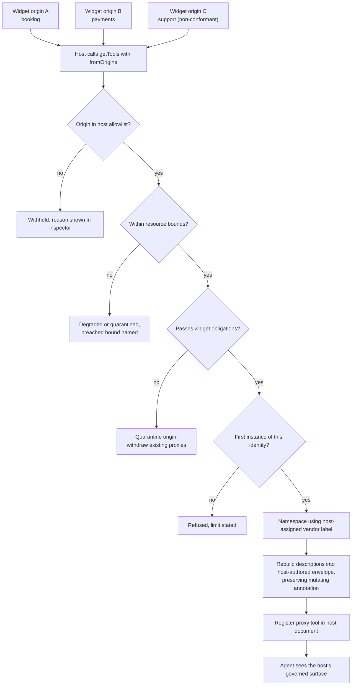
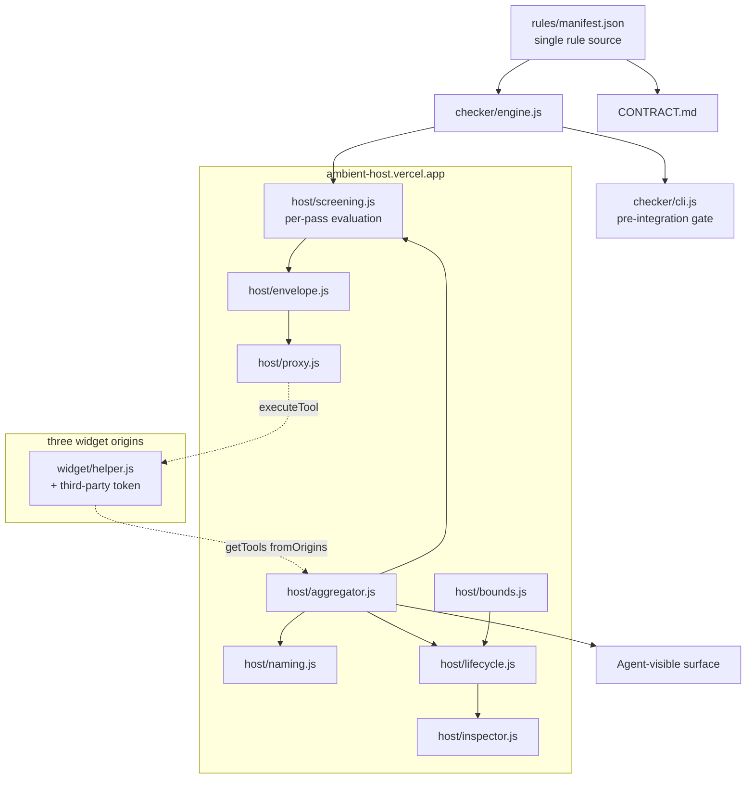
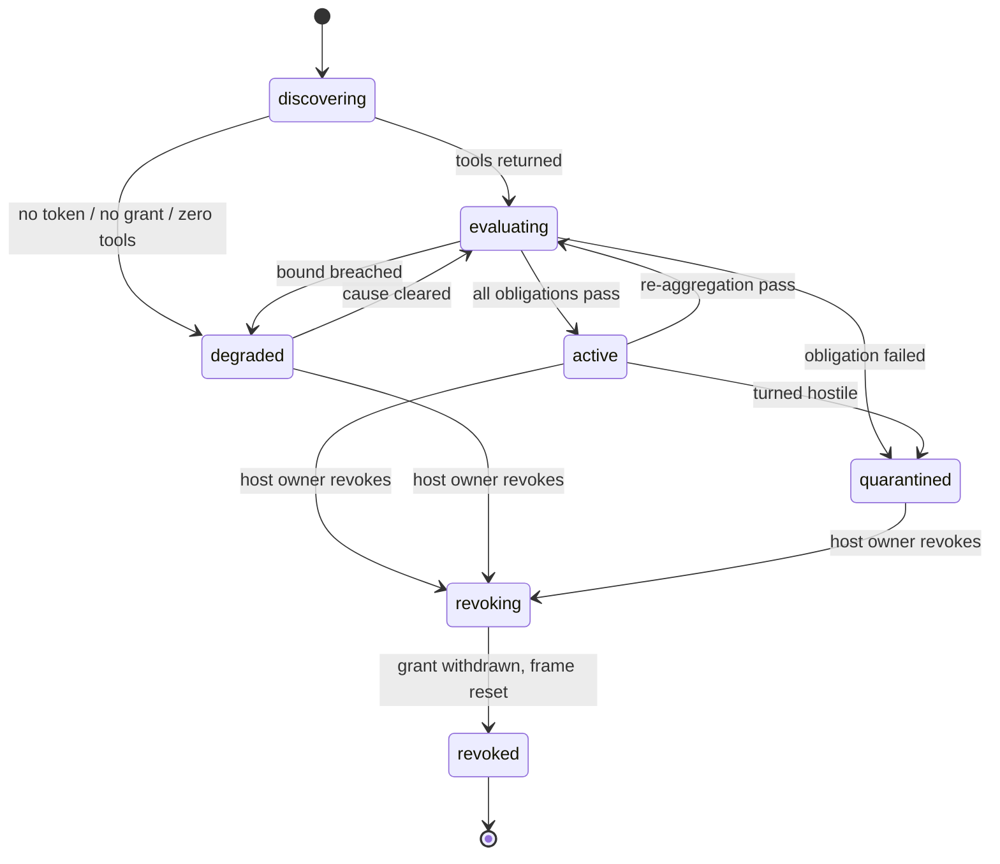
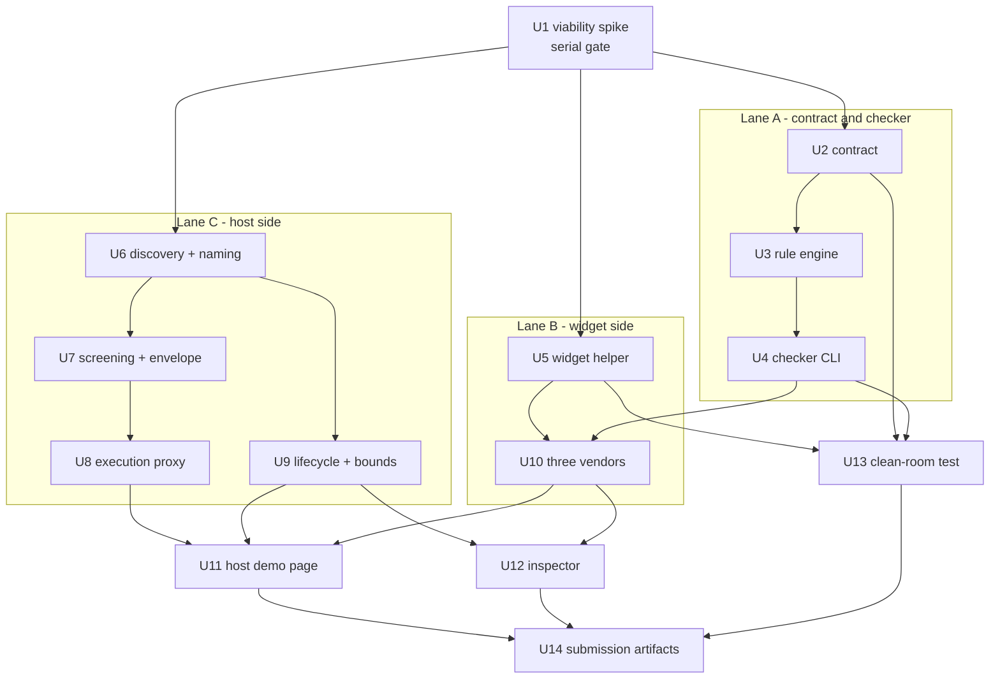

# Ambient - Plan

## Goal Capsule

- **Objective:** A host site owner can expose the capabilities of the third-party widgets they embed as one coherent, attributable, governable, and revocable agent surface — without writing tool code themselves, and without inheriting each vendor's naming, claims, or text unexamined. The conformance contract and its reference implementation are the means, not the objective.
- **Delivery constraint:** Shipped as a WebMCP Challenge submission — a live URL a judge can reach with no install step, a public repository, and a video under three minutes.
- **Product authority:** Tomiwa. Solo builder driving parallel agentic harnesses.
- **Hard deadline:** 2026-09-03, 13:00 PDT (16:00 ET). No extension exists.
- **Open blockers:** None. Empirical unknowns are sequenced into U1 and listed as spike gates — see Outstanding Questions. Each is claim-adjusting rather than build-blocking.
- **Execution profile:** U1 is serial and gates all fan-out. After it, three lanes run in parallel — contract and checker, widget side, host side — converging on the demo. Integration risk is the binding constraint, not implementation speed; the checker is the gate that keeps parallel output composable.
- **Stop conditions:** Stop and surface rather than guessing if U1 disproves a spike gate in a way the fallback ladder does not cover, if a Product Contract requirement turns out unbuildable as written, or if the Wednesday freeze arrives with a protected item outstanding. Do not resolve a contradiction between this plan and the Product Contract by editing the Product Contract.
- **Tail ownership:** The builder owns deploys, origin trial token minting, and the video. No CI gate exists; the checker CLI is the gate and is run locally before each origin is redeployed.
- **Product Contract preservation:** Unchanged by this planning pass. The contract was revised under separate review before planning; planning treats it as input.

---

## Product Contract

### Summary

Ambient defines what a third-party widget must do to be a good citizen in someone else's tool namespace, and what a host page must do to govern the result. It ships as a short conformance contract, a host aggregator, a widget helper, a conformance checker, and a four-origin demo in which a plain page becomes agent-operable by pasting script tags, an agent completes a real task across two vendors, and a widget that breaks its obligations is refused a place on the host's surface and shown as refused.

### Problem Frame

A page assembled from third-party embeds is opaque to an agent. The scheduler, the checkout, and the support widget each hold real capability, and none of it is reachable except through pixel-level computer use, which is brittle and unauditable.

WebMCP supplies the plumbing. A cross-origin iframe granted the `tools` Permissions Policy can register tools, `exposedTo` gates who may call them, and a host retrieves them with `getTools({ fromOrigins })`. What the spec does not supply is any way to make the result coherent or safe.

Within a single document, registering a duplicate tool name rejects with `InvalidStateError`. Across origins there is no handling at all: `getTools()` returns both tools, sorted alphabetically, with no dedup, no rename, and no error. Disambiguation is left entirely to the caller via `RegisteredTool.window` and `RegisteredTool.origin`. No naming convention exists anywhere in the spec or Chrome's documentation — the official examples themselves mix kebab, snake, and camel case. `untrustedContentHint` and `readOnlyHint` are defined as hints that inform an agent's decisions, and neither carries a normative obligation on the consumer, so a third-party tool description flows into an agent's context as unmarked text and a tool that moves money is distinguished from one that reads a calendar only by a boolean its own author set.

The cost lands on whoever assembles the page. A host owner who embeds three vendors inherits three vendors' naming choices, three vendors' descriptions in their agent's context, three vendors' claims about what mutates, and no mechanism to refuse any of it short of removing the widget.

### Key Decisions

- **The contract is the product; the code is the reference implementation.** A library that wraps `registerTool` is plumbing the spec may absorb. The rules governing federated naming, provenance, and untrusted content survive any change to the execution mechanism, and they are what a reader recognizes as invention.

- **Provenance is the host's to assign, never the widget's to claim.** The host allowlist maps each admitted origin to its vendor label; a widget may name only the segment beneath it. A widget-declared vendor label is forgeable, and forging it is not merely impersonation: because same-document duplicate names reject with `InvalidStateError`, a hostile widget that claims a trusted vendor's label either receives the agent's calls or silently deletes the legitimate widget's capability from the surface, while passing every other obligation. Origin is the one identifier the browser supplies and nobody can assert.

- **The host proxies rather than passes through.** The aggregator discovers widget tools via `getTools({ fromOrigins })` and registers its own namespaced proxy tools in the host document, forwarding to the originals through `executeTool`. Passthrough would leave the host unable to rename, annotate, or refuse anything.

- **Revocation is enforced at the Permissions Policy, not only at the proxy layer.** Withdrawing a widget removes `allow="tools <origin>"` and resets the iframe, cutting its ability to register new tools. Dropping the proxy alone would leave future containment conditional on whether the agent also observes iframe tools directly. Removing the grant blocks new discovery and execution, but cannot undo a side effect whose execution already began; Ambient drops any late result and reports the in-flight race in the inspector.

- **Ambient governs exposure, not model behavior.** Once third-party text reaches an agent's context, no page-side mechanism can constrain how the model treats it — Chrome's own tool-security guidance states that safety inside an LLM cannot be guaranteed. What Ambient provides is four properties it can actually deliver: *deterministic provenance*, because every agent-visible string is rebuilt by the host and carries the origin that contributed it; *bounded exposure*, because only allowlisted origins reach the surface and quarantine removes one entirely; *risk signaling*, because host-authored delimiters and preserved hints mark third-party data as third-party; and *defense-in-depth filtering*, because pattern detection removes known-shape attacks before they are ever rebuilt. Delimiters do not enforce model behavior, and an undetected instruction may still influence an agent. The contract says so in those words.

- **Conformance is three kinds of evidence, and the checker never conflates them.** Some obligations are mechanically verifiable from the registered tool surface — naming, schema shape, `exposedTo` scope, declared hints. Some are semantic properties the API cannot reveal, and for those the vendor attests. Some are observable only by running the tool, and those are exercised against instrumented reference widgets where the harness controls the state being written. Reporting a vendor's attestation as a passing mechanical check would make the checker's output a lie.

- **`.` is the namespace separator.** Tool names are restricted to ASCII alphanumerics plus `_`, `-`, and `.`, so `/`, `:`, and `@` are unavailable. Of the three permitted characters, `.` is the only one absent from every official Chrome example.

- **One instance per vendor and widget identity in v1.** Two copies of the same widget on one page produce the same composed name, and the second registration rejects. Rather than invent a host-assigned instance segment — which costs namespace design, inspector surface, and length budget for a case the demo does not need — v1 defines conformance for a single instance per identity, refuses the second visibly, and says so in the contract.

- **`readOnlyHint` is metadata, not authorization.** Chrome documents the annotation as an input to the agent's decision about when to ask for confirmation; nothing enforces it. Authorization therefore belongs where the state actually changes: the widget enforces user confirmation and existing session permissions at execution time. The host's obligation is to carry the mutating annotation through to the agent intact and never to weaken it.

- **The conformance checker is critical path, not a stretch goal.** With work fanned out across parallel agents, the checker is the only mechanism keeping their output composable, and it doubles as the instrument that catches the hostile widget on camera.

- **The demo argues adoption first, containment second.** The hook is a plain page becoming operable by pasting script tags and an agent completing a real task across two vendors; the payoff is a widget misbehaving and being refused. Adoption alone reads as convenience; containment alone reads as a linter.

- **The widget helper carries a third-party origin trial token.** WebMCP's trial supports third-party tokens, and they must be delivered from an external JavaScript file — which is what the helper already is. Adopting Ambient therefore enables WebMCP on any host embedding the widget, turning the vendor-distribution argument from narration into a working mechanism.

### Actors

- A1. **Host site owner** — assembles a page from third-party embeds, pastes the aggregator, sets which origins may contribute and under what label, and revokes one when they choose.
- A2. **Widget vendor** — ships an embeddable widget and adopts the contract so their capability travels with the embed.
- A3. **Visiting agent** — ChatGPT's in-app browser or Chrome with WebMCP enabled; consumes the host's tool surface.
- A4. **End user** — states an outcome and watches it execute on the page.
- A5. **Non-conformant widget** — an embed that misdeclares its behavior, over-collects input, carries instructions in its tool description, impersonates another vendor, or consumes disproportionate surface, metadata, or execution capacity. Adversary, and the demo's second act.

### Requirements

**The conformance contract**

- R1. The contract states obligations for two roles separately: what a widget must do to be federated, and what a host must do to federate safely.
- R2. Each obligation names the failure it prevents, so a reader can tell why the rule exists without reading the implementation.
- R3. The contract is readable end to end in under two minutes.
- R36. The contract states plainly what Ambient does not prevent: that provenance labels, delimiters, and pattern detection do not constrain how a model treats text once it enters the agent's context, and that an undetected agent-directed instruction may still influence the agent.

**Widget obligations**

- R4. A widget declares only its own widget identifier; the vendor label is assigned by the host, so a widget cannot assert who it is.
- R5. A widget restricts `exposedTo` to host origins it has been embedded into, never a wildcard.
- R6. A widget marks every tool returning content it did not author with `untrustedContentHint`.
- R7. A widget declares `readOnlyHint` truthfully; any tool that mutates state, sends a message, or moves money declares itself mutating.
- R8. A widget's input schema accepts only parameters the tool needs, and never a free-form context or passthrough field.
- R9. A widget's tool description states capability only, and carries no instruction directed at the agent.
- R10. A widget notifies its host when its own tool surface changes, so the host need not depend on cross-origin event propagation.
- R37. A widget supplies a machine-readable attestation for the obligations the registered surface cannot reveal — that declared hints match real behavior, that returned content is marked when not self-authored, and that mutating tools enforce authorization.
- R38. A widget enforces authorization at execution time for every mutating or sensitive tool: it obtains user confirmation and honors the session's existing permissions before the side effect occurs, and does not treat the presence of a tool call as authorization.

**Host aggregator obligations**

- R11. The aggregator admits tools only from origins the host has allowlisted, and derives each tool's vendor label from that allowlist entry rather than from the widget.
- R12. The aggregator assigns every federated tool a namespaced name of the form `vendor.widget.verb`, within the 128-character hard limit and within Chrome's recommended name budget wherever the vendor and widget segments allow.
- R13. The aggregator rebuilds every agent-visible string a widget supplies — descriptions, parameter descriptions, enum values, and returned content — into a host-authored envelope carrying the contributing origin and explicit third-party-data delimiters.
- R14. The aggregator additionally detects agent-directed instructions in widget-supplied text and quarantines on a match, as a filtering layer that reduces exposure rather than a guarantee of containment.
- R15. Quarantine is per-origin and retroactive: a widget failing any obligation contributes no tools, and any proxies already registered for that origin are withdrawn.
- R16. The aggregator re-evaluates every admitted widget on each aggregation pass, so a widget that turns hostile after load is caught.
- R17. The host can revoke a widget's tools without removing the widget from the page, by withdrawing its Permissions Policy grant.
- R18. The aggregator keeps the exposed surface current as widgets register and unregister, and serializes overlapping aggregation passes so a pass triggered by its own proxy registrations cannot recurse. If the viability spike cannot verify reliable cross-origin `toolchange` propagation, the host runs re-aggregation on a bounded schedule and treats widget notifications only as an acceleration path.
- R19. The aggregator returns a structured failure envelope, rather than hanging or throwing, when a proxied tool is unavailable, errors, or exceeds a bounded execution timeout. A result arriving after timeout or revocation is discarded rather than forwarded.
- R20. Namespaced names are normalized and validated before registration; a name that collides, exceeds the length limit, or carries characters illegal in tool names is rejected rather than truncated or coerced.
- R39. The aggregator carries a widget's mutating annotation through to the agent unchanged and never presents a tool the widget declared mutating as read-only.
- R40. Conformance is defined for one instance per vendor and widget identity. A second instance of the same identity is refused rather than silently dropped, renamed, or coerced, and the inspector states that the limit was reached.

**Conformance checker**

- R21. The checker evaluates a widget against every widget obligation and reports pass or fail per rule, across three classes of evidence: rules verified mechanically from the registered tool surface, rules covered by vendor attestation, and rules observed by executing the tool.
- R22. The checker detects a tool whose declared `readOnlyHint` contradicts its observed behavior, against instrumented reference widgets whose state changes the harness can see. Ambient does not claim generic false-read-only detection for arbitrary third-party widgets.
- R23. The checker detects agent-directed instructions in a tool description without rejecting the representative benign instruction-like descriptions in its control suite.
- R24. The checker runs against all demo widgets as a pre-integration gate, not only as a demo surface.
- R41. Every checker result names its evidence class, so a reader can tell what was proven from the surface, what was executed, and what rests on the vendor's word.
- R42. At least one conformant widget is implemented solely from the written contract and the public helper documentation, without inspecting the aggregator or any existing widget implementation, to establish that the contract is sufficient on its own. An isolated agent context satisfies the clean-room condition.

**Reference demo**

- R25. Four independently deployed origins: one host site and three widget vendors.
- R26. Two widgets register a tool with the same unqualified verb, so collision resolution is observable rather than asserted.
- R27. One widget is non-conformant in a way the checker catches and the aggregator blocks.
- R28. The host page shows which origin supplied each available tool.
- R29. The host page shows per-origin federation status and the reason for the current state, so a silent failure is distinguishable from a deliberate block. It also shows when an execution was already in flight at revocation, states that its side effect may still complete, and confirms that any late result was discarded.
- R30. The page detects an unsupported browser and explains what is required rather than rendering blank.
- R31. A judge reaches full functionality from the live URL with no installation step.
- R43. An agent completes an end-to-end task through the federated surface that produces a visible page-level outcome, so adoption is demonstrated by a result rather than by a populated tool list.
- R44. The federation inspector provides a per-origin revocation control the host owner operates directly, which progresses visibly through revoking and revoked rather than changing state instantly.
- R45. The demo presents in three tiers of descending prominence: adoption and a successful agent outcome first; the available namespaced tools and their provenance second; containment and diagnostic evidence third.
- R46. The inspector represents each origin in one of seven lifecycle states — discovering, evaluating, active, degraded, quarantined, revoking, revoked — and every state carries a reason.

**Resource bounds**

- R47. The aggregator bounds the number of tools it will admit from any single origin.
- R48. The aggregator bounds the size of widget-supplied metadata it will rebuild — tool and parameter descriptions, names, and schemas — against Chrome's published character budgets.
- R49. The aggregator bounds the size of a returned result it will place in an envelope.
- R50. The aggregator bounds the number of concurrent executions in flight for any single origin.
- R51. The aggregator bounds how frequently an origin may change its tool surface before the origin is treated as degraded.
- R52. Exceeding any bound moves the origin to degraded or quarantined with the breached bound named in the inspector; it never results in silent truncation, silent dropping, or an unbounded wait.

**Sensitive-data posture**

- R53. No tool in the demo accepts or returns credentials, secrets, tokens, or payment instrument numbers, and the contract names this as a widget obligation.
- R54. The demo operates entirely on synthetic data, and every tool requests the minimum input its stated capability needs.
- R55. Widget-supplied text matching credential, token, or payment-instrument shapes is redacted before it enters an envelope or an inspector log.
- R56. Inspector logs are session-scoped and held in memory only; they are not persisted across reloads and are not transmitted off the host origin.

**Accessibility**

- R57. Every interactive control in the demo and inspector is reachable and operable by keyboard alone.
- R58. Asynchronous status changes — aggregation completing, an origin being quarantined, a revocation finishing — are announced semantically rather than conveyed only by visual repaint.
- R59. No federation state is communicated by color alone.
- R60. Focus lands predictably after a revocation or a failure, rather than being lost to the document root when a control disappears.
- R61. The demo and inspector remain usable at a narrow viewport as well as at desktop width.

**Submission artifacts**

- R32. Public repository with an open-source license visible in the About panel.
- R33. Demo video under three minutes, public on YouTube, with audio, opening on the adoption moment.
- R34. Written description that names the specific spec gaps Ambient fills and the limits of what it enforces.
- R35. Every origin serves a valid Chrome origin trial token so judges need no browser flag, and the token remains valid through the judging window.

### Federation path



### Key Flows

- F1. **Adoption**
  - **Trigger:** A1 pastes the aggregator script and three widget embeds into a page with no first-party WebMCP code.
  - **Actors:** A1, A2, A3, A4
  - **Steps:** Aggregator discovers tools across allowlisted origins; screens each against the widget obligations; namespaces with host-assigned labels, rebuilds descriptions, registers proxies in the host document; agent's surface populates; A4 states an outcome and the agent completes it through the federated tools.
  - **Outcome:** The page is agent-operable without first-party tool code, demonstrated by a completed task with a visible page-level result.
  - **Covered by:** R11, R12, R13, R25, R31, R43, R45

- F2. **Collision resolution**
  - **Trigger:** Two allowlisted widgets each register a tool with the same unqualified verb.
  - **Actors:** A2, A3
  - **Steps:** Aggregator derives distinct namespaced names from each origin's allowlist label; both proxies register without an `InvalidStateError`; each carries its origin in its description envelope; the agent invokes both and receives vendor-specific results.
  - **Outcome:** Both capabilities remain reachable, distinguishable, and independently callable.
  - **Covered by:** R11, R12, R20, R26, R28, R43

- F3. **Containment**
  - **Trigger:** A5 ships a tool carrying agent-directed instructions, misdeclares `readOnlyHint`, claims another vendor's origin label, or breaches a resource bound.
  - **Actors:** A5, A1, A3
  - **Steps:** Checker flags the violated obligation and names its evidence class; aggregator quarantines the origin and withdraws any proxies already registered for it; inspector shows what was refused and why; the tool is never registered on the host's surface.
  - **Outcome:** The hostile capability is refused a place on the host's governed surface, and the host owner can see it was refused. Whether the agent can reach the widget's own tools directly is a separate question the spike settles; the Permissions Policy grant is what makes the answer not matter.
  - **Covered by:** R4, R7, R9, R11, R13, R14, R15, R16, R21, R22, R23, R27, R41, R52

- F4. **Revocation**
  - **Trigger:** A1 operates the inspector's per-origin revocation control while leaving the widget on the page.
  - **Actors:** A1, A3
  - **Steps:** Origin enters revoking; host removes it from the allowlist, withdraws its `allow="tools <origin>"` grant and resets the frame; aggregator aborts the affected proxy registrations; origin settles in revoked; agent's surface updates for new calls; any execution already in flight is shown in the inspector and its late result is discarded.
  - **Outcome:** New discovery and execution are withdrawn without changing page content, and the widget cannot re-register. A side effect that began before revocation may still complete and is reported rather than represented as cancelled.
  - **Covered by:** R15, R17, R18, R19, R29, R44, R46, R60

- F5. **Degraded federation**
  - **Trigger:** An allowlisted origin fails to load, lacks a valid origin trial token, returns no tools, or breaches a resource bound.
  - **Actors:** A1
  - **Steps:** Aggregator records the per-origin cause; inspector distinguishes the lifecycle states and names the reason for each; other origins aggregate unaffected.
  - **Outcome:** A silent failure is legible rather than indistinguishable from a deliberate block.
  - **Covered by:** R19, R29, R30, R46, R52

### Acceptance Examples

- AE1. **Covers R12, R26.** Given widget `acme.booking` and widget `zenith.support` each register `search`, when the host aggregates, then both appear to the agent as `acme.booking.search` and `zenith.support.search`, and neither registration rejects.
- AE2. **Covers R4, R11, R15.** Given a widget served from an origin the host labels `zenith` attempts to present itself as `acme`, when the host aggregates, then the origin is quarantined and the inspector records the R4 violation.
- AE3. **Covers R7, R22, R41.** Given an instrumented reference widget declares `readOnlyHint: true` on a tool that writes state the harness observes, when the checker executes it, then the checker fails that widget on the truthful-annotation obligation and reports the result as observed rather than attested.
- AE4. **Covers R9, R13, R14, R23.** Given a tool description contains an instruction addressed to the agent, when the aggregator processes it, then the origin is quarantined and the inspector records the violated rule.
- AE5. **Covers R15, R16.** Given a widget passes conformance at load and registers a non-conformant tool later, when the next aggregation pass runs, then the origin is quarantined and its previously registered proxies are withdrawn.
- AE6. **Covers R11, R15.** Given a widget registers tools from an origin the host has not allowlisted, when the agent requests the surface, then those tools are absent and the inspector shows the origin was refused.
- AE7. **Covers R18.** Given an allowlisted widget aborts its registrations mid-session, when the host next aggregates, then the corresponding proxies drop without disturbing other widgets' tools.
- AE8. **Covers R19.** Given the agent calls a proxy whose underlying widget has unloaded or does not resolve within the timeout, when the call is made, then the proxy returns a structured failure envelope naming the cause rather than hanging.
- AE9. **Covers R8.** Given a tool's input schema declares a free-form context parameter, when the checker evaluates it, then the checker fails that widget on the minimal-input obligation.
- AE10. **Covers R20.** Given a composed namespaced name would exceed 128 characters or contain an illegal character, when the aggregator registers it, then registration is refused and the inspector records why, rather than the name being truncated or coerced.
- AE11. **Covers R14, R23.** Given representative benign descriptions contain instruction-like language but do not direct the agent to change its behavior, when the checker and aggregator evaluate them, then the descriptions remain available while the malicious control descriptions are quarantined.
- AE12. **Covers R12, R26, R28, R43.** Given the booking and support widgets both expose a namespaced `search` and the agent is asked for an outcome requiring both, when the agent invokes `acme.booking.search` and `zenith.support.search`, then each returns its own vendor's results, the page reflects a completed task visibly, and the inspector attributes each call to its contributing origin.
- AE13. **Covers R21, R37, R41.** Given a widget attests that its mutating tools enforce authorization, when the checker reports on that obligation, then the result is labelled as resting on vendor attestation and is not presented as mechanically verified.
- AE14. **Covers R1, R2, R3, R42.** Given an isolated context is given only the written contract and the public helper documentation, when it implements a widget without access to the aggregator or any existing widget, then that widget passes the checker's mechanically verifiable rules on first integration.
- AE15. **Covers R17, R44, R46.** Given the host owner operates the per-origin revocation control, when revocation is under way, then the origin displays revoking, settles in revoked, and its tools are absent from the agent's surface for subsequent calls.
- AE16. **Covers R7, R38, R39.** Given a mutating tool is invoked without prior user confirmation, when the widget executes it, then the widget requires confirmation before the side effect occurs, and the tool remains annotated as mutating on the host's surface.
- AE17. **Covers R40.** Given the same vendor and widget identity is embedded twice on one page, when the host aggregates, then the first instance federates, the second is refused, and the inspector states that the one-instance limit was reached rather than reporting a name collision.
- AE18. **Covers R47, R52.** Given an admitted origin registers more tools than the per-origin bound permits, when the host aggregates, then the origin moves to degraded, the breached bound is named in the inspector, and no partial or truncated tool set is exposed to the agent.
- AE19. **Covers R53, R55.** Given widget-supplied text contains a string shaped like a credential or payment instrument, when the aggregator builds the envelope and the inspector logs the pass, then the value is redacted in both.
- AE20. **Covers R57, R58, R60.** Given a keyboard-only operator revokes an origin, when the revocation completes, then the state change is announced semantically and focus rests on a predictable control rather than the document root.

### Success Criteria

- A judge opens the live URL in a supported browser and reaches full functionality with no install step and no browser flag.
- A judge sees an agent complete a real task across two vendors before seeing any diagnostic surface.
- The video shows adoption, collision, and containment inside three minutes, with the adoption moment inside the first forty seconds.
- The checker gates integration: every conformant widget passes before it ships, the intentionally non-conformant demo widget fails on the specific rule it violates, and every result names whether it was verified, executed, or attested.
- A widget built only from the written contract passes the checker's mechanically verifiable rules on first integration.
- A reader who never runs the code can state, from the contract alone, which spec gaps Ambient fills and which risks it does not remove.
- No federation failure during a live demo is indistinguishable from the demo's own containment payoff.

### Scope Boundaries

**Deferred for later**

- Host-assigned instance segments allowing the same vendor and widget identity to federate more than once on a page.
- Generic false-read-only detection for arbitrary third-party widgets, as opposed to instrumented reference widgets.
- Browser-extension build of the aggregator for demonstrating on sites the team does not control. Adds an install step between a judge and the live URL.
- Vendor dashboard, tool versioning, and adoption analytics.
- Package publication as the primary artifact.
- A hosted registry of conformant vendors.

**Outside this product's identity**

- Not a general-purpose MCP client or tool-authoring framework. That ground is occupied by MCP-B and the existing framework bindings.
- Not an agent. Ambient governs a tool surface; it does not reason over one.
- Not a wrapper that retrofits non-cooperating third-party embeds. Cross-origin injection into another vendor's iframe is not possible, and claiming otherwise would misrepresent what the demo shows.
- Not a defense against prompt injection inside the model. Ambient bounds what reaches the agent and labels where it came from; it does not and cannot govern what the model does with text once that text is in context.
- Not an authorization system. Ambient preserves and surfaces the mutating annotation; the widget enforces authorization where the state changes.

**Designated cuts under deadline pressure**

If the Wednesday freeze arrives with work outstanding, cut in this order:

1. Generic behavioral-contradiction detection beyond the instrumented reference widgets (R22), which falls back to the vendor attestation the contract already requires.
2. The clean-room portability exercise (R42) — a validation activity rather than a shipped artifact. If cut, the write-up drops the claim that the contract was independently reproducible.
3. Enforcement of resource bounds beyond a single tool-count cap (R48 through R51), which become documented but unenforced limits, stated as such in the inspector.

Protected: the contract, the four origins, containment, the per-origin revocation control, and the third-party origin trial token. The third-party token is the working mechanism behind the vendor-distribution argument, not a convenience; cut it only if the viability spike proves it cannot function from a widget helper inside a cross-origin iframe, and if cut, drop the distribution claim rather than restate it as narration.

### Dependencies / Assumptions

Verified against primary sources on 2026-08-31. Items marked UNVERIFIED are the day-one spike.

**Cross-origin federation**

- Federation requires a three-way AND: the host embeds with `allow="tools <origin>"`, the widget registers with `exposedTo: ['https://host']`, and the host calls `getTools({ fromOrigins: [...] })`. If any one is missing the result is an empty tool list with **no error** — which is why R29 exists.
- `exposedTo` is bidirectional: it grants access both when the widget is embedded on that origin and when that origin is embedded in the widget.
- `exposedTo` and `fromOrigins` accept **secure origins only**. Local development needs four distinct HTTPS origins; `localhost` with differing ports will not do.
- A working reference exists: `GoogleChromeLabs/webmcp-tools/demos/page-agent` implements exactly this pattern, including the `iframe.allow = \`tools ${origin}\`` form used when the frame's `src` is dynamic. `WebMCP-org/examples` contains no cross-origin example.
- UNVERIFIED: whether a cross-origin child's registration changes fire `toolchange` in the embedder's document. R18, F4, and AE7 depend on the host learning about child changes; R10's widget-side notification exists so the answer is not load-bearing.
- UNVERIFIED: whether an agent observes cross-origin iframe tools directly alongside the host's proxies. Chrome's imperative-API documentation does not address it. R17's Permissions Policy enforcement is what keeps containment meaningful either way, but the answer determines whether Ambient may honestly describe its output as one governed surface — see Outstanding Questions.

**Origin trial**

- Trial ID `4163014905550602241`, Chromium trial name `WebMCP`, milestones 149–156. Self-service, `ot_require_approvals: false` — tokens issue immediately, no review queue.
- **Iframes do not inherit the embedder's token.** Each of the four origins needs its own token, delivered by meta tag or `Origin-Trial` header in that origin's own document.
- The trial supports **third-party tokens** (`ot_has_third_party_support: true`). A third-party token must be delivered from an external JavaScript file — not a meta tag, inline script, or HTTP header — by creating the meta element at runtime. Third-party registration carries a usage cap (standard limit 0.5% of Chrome page loads); first-party tokens carry none. Chrome's third-party trial documentation does not state a restriction against cross-origin iframes and references a cross-origin iframe demo, but does not confirm the widget-helper case; the spike settles it.
- Registration offers a match-all-subdomains option, but **subdomain tokens are not issued for origins on the Public Suffix List**, and `vercel.app` is on that list. Four `*.vercel.app` subdomains therefore need four separate tokens. One custom registrable domain with four subdomains takes a single subdomain-matched token. `netlify.app` and `pages.dev` are likely the same but were not confirmed.
- Judging happens after the 3 Sep deadline, so token validity must extend past the judging window, and tokens minted for production hostnames do not cover preview-deployment hostnames.

**API surface**

- Tool names: `[A-Za-z0-9_.-]`, 1–128 characters, enforced with `InvalidStateError`. `/`, `:`, and `@` are unavailable as separators.
- Chrome recommends far tighter budgets than the hard limits: 30 characters for tool and parameter names, 500 for a tool description, 150 for a parameter description, and 1.5K for a tool's output. `vendor.widget.verb` consumes name budget that an unqualified verb does not, so short vendor and widget segments are a design constraint, not a preference. These budgets are the defensible basis for R48 and R49.
- Same-document duplicate registration rejects rather than overwriting. A revoke-then-restore cycle must observe the abort as complete before re-registering the same name. This is also what makes a second instance of one widget identity unfederatable without an instance segment — see R40.
- Unregistration is by `AbortController` only; there is no `unregisterTool()`. As of Chrome 153 aborting no longer cancels in-flight executions, so a result arriving after revocation must be dropped rather than forwarded.
- `execute` returns `Promise<any>`, serialized by the UA to a JSON string; `executeTool` resolves to a `DOMString`. A non-serializable return fails the execution with a null result rather than throwing to the callback.
- **Documentation conflict:** the spec types `executeTool`'s input as a WebIDL `object`; Chrome's imperative-API docs pass a JSON string. Ship a runtime adapter that tries one and falls back to the other, rather than choosing at build time — the trial is live and this can move between now and judging.
- `untrustedContentHint` and `readOnlyHint` are both hints that inform an agent's decisions and impose no consumer obligation. Chrome describes `readOnlyHint` as helping an agent decide when to ask for confirmation, and nothing enforces it — which is why R38 places authorization in the widget. Ambient's handling of untrusted text and of authorization is additive to the spec, not an implementation of it.
- Chrome's tool-security guidance states that safety inside an LLM cannot be guaranteed and that repeatable prompt-injection attacks have succeeded against state-of-the-art models. Its recommended mitigation is bounding exposure through `exposedTo`. This is the primary-source basis for the Key Decision on what Ambient does and does not provide.
- Neither the spec nor Chrome's documentation states limits on tool count, schema size, or concurrent executions. R47, R50, and R51 are therefore Ambient's own bounds, and their thresholds are a planning decision.
- Cross-traversable execution rejects with `UnknownError`; spec issue #227 (open) concerns discovery scope across a browsing context group.
- A `webmcp-polyfill.js` exists in `GoogleChromeLabs/webmcp-tools/demos/shared/` and is a viable fallback if a token fails on demo day.

**Project**

- One builder with parallel agents. Integration risk, not implementation speed, is the binding constraint; the conformance checker is the integration gate.
- No existing codebase. Greenfield.

### Outstanding Questions

**Resolve Before Planning**

- None.

**Spike gates**

These are settled by the day-one viability spike and change what the submission may claim.

- Whether an agent observes cross-origin iframe tools directly alongside the host's proxies. If it does, Ambient cannot honestly describe its output as the agent's only surface; the claim narrows to the host's governed surface being the coherent, attributable one, and the write-up says which tools remain reachable outside it.
- Whether a third-party origin trial token functions when delivered from a widget helper inside a cross-origin iframe. This decides whether the vendor-distribution argument is a working mechanism or is dropped.
- Whether `toolchange` propagates across origins, which decides whether R18's bounded re-aggregation schedule is the primary mechanism or a backstop.

**Settled during planning**

These were handed to planning and are now decided; the Planning Contract holds the rationale.

- The viability spike is U1 and is serial. The fallback ladder if it fails is KTD10: same-site subdomain federation, then same-origin modules with the limitation stated plainly in the write-up.
- Four `*.vercel.app` origins with four separate first-party tokens (KTD8). The widget capabilities are booking, checkout, and support; booking and support share `search` so F2 is observable, and support turns hostile mid-demo rather than at load, which exercises R16 and chains collision into containment in one take (U10).
- Envelope format and detection patterns: KTD6 and KTD7, built in U7.
- Attestation format and its consumption by the checker: U5 emits it, U3 consumes it as a distinct evidence class.
- Inspector presentation of the seven states and the revocation control's shape: U12.

**Deferred to implementation**

- Numeric thresholds for the three bounds Chrome does not supply — tools per origin, concurrent executions per origin, surface-change frequency. U9 sets them against observed behavior from the deployed widgets rather than guessing them now.
- Resist extracting a generalized framework or package infrastructure before submission. The reference implementation exists to prove the contract; premature generalization spends the deadline on ground the Scope Boundaries already place outside this product's identity. Carried as a global Definition of Done criterion.

### Sources / Research

All claims verified against primary sources on 2026-08-31.

| Claim | Source |
|---|---|
| Tool names: 1–128 chars, `[A-Za-z0-9_.-]` only, else `InvalidStateError` | [WebMCP spec, `registerTool`](https://webmachinelearning.github.io/webmcp/) |
| Same-document duplicate name rejects; no overwrite | [WebMCP spec, `registerTool`](https://webmachinelearning.github.io/webmcp/) |
| Cross-origin: `getTools()` returns a flat list with no dedup or error; `window` and `origin` are the only disambiguators | [WebMCP spec, `getTools`](https://webmachinelearning.github.io/webmcp/) |
| `tools` Permissions Policy defaults to `'self'`; cross-origin iframes need `allow` | [WebMCP spec §4.5](https://webmachinelearning.github.io/webmcp/) · [Chrome docs](https://developer.chrome.com/docs/ai/webmcp) |
| `exposedTo` / `fromOrigins` are both required and accept secure origins only | [Chrome imperative API](https://developer.chrome.com/docs/ai/webmcp/imperative-api) |
| Working cross-origin reference implementation | [webmcp-tools `demos/page-agent`](https://github.com/GoogleChromeLabs/webmcp-tools) |
| Iframes do not inherit origin trial access | [Chrome origin trial troubleshooting](https://developer.chrome.com/docs/web-platform/origin-trials) |
| Third-party tokens: external JS file only; not meta tag, inline script, or header; 0.5% standard usage cap | [Third-party origin trials](https://developer.chrome.com/docs/web-platform/third-party-origin-trials) |
| Subdomain tokens not issued for Public Suffix List origins | [Chrome origin trials guide](https://developer.chrome.com/docs/web-platform/origin-trials) |
| `vercel.app` is on the Public Suffix List | [Vercel KB](https://vercel.com/kb/guide/can-i-set-a-cookie-from-my-vercel-project-subdomain-to-vercel-app) |
| Unregistration via `AbortSignal`; in-flight executions survive as of Chrome 153 | [Chrome imperative API](https://developer.chrome.com/docs/ai/webmcp/imperative-api) |
| `untrustedContentHint` and `readOnlyHint` are hints with no normative consumer obligation | [WebMCP spec](https://webmachinelearning.github.io/webmcp/) · [Chrome tool security](https://developer.chrome.com/docs/ai/webmcp/secure-tools) |
| `readOnlyHint` informs when an agent asks for confirmation; nothing enforces it | [Chrome tool security](https://developer.chrome.com/docs/ai/webmcp/secure-tools) |
| Safety inside an LLM cannot be guaranteed; repeatable prompt injection has succeeded against state-of-the-art models; recommended mitigation is bounding exposure via `exposedTo` | [Chrome tool security](https://developer.chrome.com/docs/ai/webmcp/secure-tools) |
| Recommended budgets: 30 chars for names, 500 for tool descriptions, 150 for parameter descriptions, 1.5K for tool output | [Chrome tool security](https://developer.chrome.com/docs/ai/webmcp/secure-tools) |
| No documented limits on tool count, schema size, or concurrent executions | Verified absent across [spec](https://webmachinelearning.github.io/webmcp/) and [Chrome imperative API](https://developer.chrome.com/docs/ai/webmcp/imperative-api) |
| Spec/Chrome conflict on `executeTool` input: WebIDL `object` vs JSON string | [Spec IDL](https://webmachinelearning.github.io/webmcp/) vs [Chrome imperative API](https://developer.chrome.com/docs/ai/webmcp/imperative-api) |
| Cross-origin agent visibility of iframe tools is undocumented | Verified absent from [Chrome imperative API](https://developer.chrome.com/docs/ai/webmcp/imperative-api) |
| Origin trial from Chrome 149; local flag `chrome://flags/#enable-webmcp-testing` | [Origin trial blog](https://developer.chrome.com/blog/ai-webmcp-origin-trial) |
| No official tool-naming convention exists | Verified absent across spec, Chrome docs, and repo README |

Prior art surveyed for overlap: music composer, Super Mario level generator, Excalidraw, Graphite vector draw, React flight search, and the framework bindings catalogued in [awesome-webmcp](https://github.com/leanMCP/awesome-webmcp). None address federation, naming, or third-party governance.

Challenge terms: [The WebMCP Challenge](https://webmcp.devpost.com/).

---

## Planning Contract

### Key Technical Decisions

- KTD1. **No build step, plain ES modules, static hosting.** The adoption claim in F1 and R31 is that a plain page becomes agent-operable by pasting script tags. A bundler in the consumer's path would contradict the product's central argument, so every shipped artifact is a hand-authored ES module served as a static file. A deploy-time file copy (`scripts/sync-sites.mjs`) fans shared modules out to each origin's directory; that is a deploy step, not a consumer build step, and the distinction is worth stating in the write-up.

- KTD2. **One machine-readable rule manifest is the single source for the contract, the CLI checker, and the inspector.** R21 requires per-rule reporting across three evidence classes and R41 requires every result to name its class. Coding the checker independently of the prose contract would let the two drift, and a drifted checker reports a rule the contract does not state. `rules/manifest.json` carries rule id, role, evidence class, and the failure it prevents; `CONTRACT.md` is generated-adjacent prose that cites the same ids, and both checker surfaces execute the same engine.

- KTD3. **Runtime adapter for `executeTool` input, decided per call, not per build.** The spec types the parameter as WebIDL `object`; Chrome's imperative-API docs pass a JSON string. `src/shared/adapter.js` attempts one shape, detects the failure mode, falls back, and caches the winning shape for the session. U1 settles which is live today; the adapter exists because the trial can move before judging.

- KTD4. **Node's built-in test runner, zero test dependencies.** `node --test` covers the aggregator's pure logic without adding an install step to a repo whose selling point is that it has none. Deadline pressure makes a dependency-free test path worth more than a richer matcher library.

- KTD5. **Aggregation is a single-flight serialized pass with a generation counter.** R18 forbids a pass triggered by the aggregator's own proxy registrations from recursing. A monotonic generation counter, an in-flight guard, and a queued re-run on request during a pass satisfy that without a lock library. Results from a superseded generation are discarded.

- KTD6. **The envelope is host-authored, delimited, and provenance-carrying, and it is built by construction rather than by sanitising.** R13 requires every agent-visible string to be rebuilt. The aggregator never edits widget text in place; it extracts values, redacts, truncates to budget, and writes them into a host-owned template. Text that cannot be placed in the template is dropped, not passed through.

- KTD7. **Redaction runs at two chokepoints only:** envelope construction and inspector log write. R55 and R56 are satisfied by making those the sole paths through which widget text reaches an agent or a log, rather than by scattering redaction calls.

- KTD8. **Four `*.vercel.app` origins with four separate first-party tokens; the widget helper additionally carries a third-party token.** `vercel.app` is on the Public Suffix List, so subdomain-matched tokens are unavailable. Four self-service first-party tokens issue immediately and remove domain purchase and DNS propagation from the critical path. The third-party token on the helper is the vendor-distribution mechanism and is independent of the four; U1 proves whether it functions from inside a cross-origin iframe.

- KTD9. **The one-instance limit is enforced at name composition, not discovery.** R40 refuses a second instance of the same vendor and widget identity. Detecting it where the composed name is built means the refusal reason is "instance limit reached" rather than a bare collision, which is what the inspector must show.

- KTD10. **Fallback ladder if U1 fails, in order:** same-site subdomain federation across four subdomains of one registrable domain; then same-origin modules simulating vendor boundaries. Each rung costs a claim, and the write-up states which rung shipped. Ambient does not ship a demo whose federation is simulated without saying so.

### Output Structure

```text
CONTRACT.md                     the product: widget and host obligations
README.md
LICENSE
rules/
  manifest.json                 rule id, role, evidence class, failure prevented
src/
  shared/
    adapter.js                  executeTool input-shape adapter
    patterns.js                 injection + credential/payment shapes
  host/
    aggregator.js               discovery, pass orchestration, generation counter
    naming.js                   vendor.widget.verb composition, validation, instance limit
    screening.js                obligation evaluation, quarantine
    envelope.js                 host-authored envelope construction
    redact.js                   credential and payment redaction
    proxy.js                    executeTool forwarding, timeouts, late-result drop
    lifecycle.js                seven-state model with reasons
    bounds.js                   per-origin resource bounds
    inspector.js                federation inspector UI
  widget/
    helper.js                   registerTool wrapper enforcing widget obligations
    attest.js                   attestation manifest emission
    origin-trial.js             third-party token runtime meta injection
  checker/
    engine.js                   manifest-driven rule evaluation, evidence classes
    cli.js                      pre-integration gate
sites/
  host/                         ambient-host.vercel.app
  acme-booking/                 acme-booking.vercel.app
  northwind-checkout/           northwind-checkout.vercel.app
  zenith-support/               zenith-support.vercel.app
scripts/
  sync-sites.mjs                copies src modules into each site's vendor/ before deploy
test/
docs/
  spike-report.md               U1 findings; the spike gates' answers of record
```

The per-unit file lists remain authoritative. This tree is the expected shape, not a constraint.

### High-Level Technical Design

**Component topology.** Three shipped modules, four deployed origins, one shared rule manifest.



**Per-origin lifecycle.** R46's seven states, with the transitions the inspector must render.



**Unit sequencing.** U1 is serial; three lanes fan out behind it and converge on the demo.



### Assumptions

- The three spike gates resolve in a way the fallback ladder covers. If an agent turns out to observe raw iframe tools alongside the proxies, the plan does not change — only the write-up's wording narrows, per the Product Contract's spike-gate entry.
- Four Vercel projects deploying from one repository with distinct root directories is sufficient to produce four independent origins. No platform feature beyond static hosting and per-project root directory is required.
- A judge's browser is Chrome at a milestone within the trial window (149–156). R30's unsupported-browser path covers everything else.
- The demo's agent path can be exercised via Chrome with WebMCP enabled during development; ChatGPT's in-app browser is a verification target, not a development dependency.

### Sequencing and Parallelization

U1 completes and its findings land in `docs/spike-report.md` before any other unit starts. Nothing in lanes A, B, or C is safe to begin on an assumption U1 has not confirmed — four workstreams built against a wrong answer is the failure this ordering exists to prevent.

After U1, the three lanes are independent. Lane A produces the gate that lanes B and C must pass; U4 therefore lands before U10 integrates. Within lane C, U6 → U7 → U8 is sequential because each consumes the prior's output shape, while U9 branches off U6 and runs alongside.

The convergence point is U11 and U12, which are the first units where a wrong assumption in two lanes becomes visible at once. Schedule slack before them, not after.

---

## Implementation Units

| U | Title | Key files | Depends on |
|---|---|---|---|
| U1 | Cross-origin viability spike | `sites/*/index.html`, `src/shared/adapter.js`, `docs/spike-report.md` | — |
| U2 | Conformance contract and rule manifest | `CONTRACT.md`, `rules/manifest.json` | U1 |
| U3 | Manifest-driven rule engine | `src/checker/engine.js` | U2 |
| U4 | Conformance checker CLI gate | `src/checker/cli.js` | U3 |
| U5 | Widget helper and token delivery | `src/widget/helper.js`, `attest.js`, `origin-trial.js` | U1 |
| U6 | Aggregator discovery, naming, instance limit | `src/host/aggregator.js`, `naming.js` | U1 |
| U7 | Screening, envelope, quarantine, redaction | `src/host/screening.js`, `envelope.js`, `redact.js` | U3, U6 |
| U8 | Execution proxy and failure envelopes | `src/host/proxy.js` | U7 |
| U9 | Lifecycle states and resource bounds | `src/host/lifecycle.js`, `bounds.js` | U6 |
| U10 | Three widget vendor origins | `sites/acme-booking/`, `northwind-checkout/`, `zenith-support/` | U4, U5 |
| U11 | Host demo page and agent task path | `sites/host/index.html`, `demo.js`, `allowlist.js` | U8, U9, U10 |
| U12 | Federation inspector | `src/host/inspector.js` | U9, U10 |
| U13 | Clean-room portability exercise | `docs/clean-room-report.md` | U2, U4, U5 |
| U14 | Submission artifacts | `README.md`, `LICENSE`, `docs/submission.md` | U11, U12, U13 |

### U1. Cross-origin viability spike

**Goal:** Prove on four real HTTPS origins that the three-way AND composes, and settle every empirical unknown the rest of the plan is built on.

**Requirements:** R25, R35; settles the spike gates behind R17, R18, R38, R43.

**Dependencies:** None. Serial gate — no other unit begins until this reports.

**Files:** `sites/host/index.html`, `sites/acme-booking/index.html`, `sites/northwind-checkout/index.html`, `sites/zenith-support/index.html`, `src/shared/adapter.js`, `scripts/sync-sites.mjs`, `docs/spike-report.md`

**Approach:** Deploy four Vercel projects from this repository with distinct root directories, producing `ambient-host`, `acme-booking`, `northwind-checkout`, and `zenith-support` on `*.vercel.app`. Mint four first-party origin trial tokens and deliver each by meta tag in its own origin's document. Stand up the thinnest possible pair — one widget registering one tool with `exposedTo` set to the host, one host embedding it with `allow="tools <origin>"` and calling `getTools({ fromOrigins })` — then answer each gate in turn and record the answers. Model the plumbing on `GoogleChromeLabs/webmcp-tools/demos/page-agent` rather than deriving it, including the `iframe.allow` assignment form for dynamic `src`.

**Execution note:** Empirical, not test-first. The deliverable is a written answer per gate plus the adapter; a passing unit test proves nothing here. Record negative results as carefully as positive ones — a gate that fails redirects the plan and must not be discovered twice.

**Test scenarios:**
- The three-way AND composes: host sees the widget's tool with all three conditions met.
- Removing each condition in turn yields an empty list and no error, confirming the silent-failure mode R29 exists to expose.
- `executeTool` succeeds with one input shape; the other's failure mode is recorded so the adapter can detect it.
- A cross-origin child registering a new tool either does or does not fire `toolchange` in the embedder — recorded either way.
- An agent connected to the host either does or does not observe the widget's raw tools alongside the host's own — recorded either way.
- A third-party token delivered from an external JS file inside a cross-origin iframe either does or does not activate the trial — recorded either way.

**Verification:** `docs/spike-report.md` answers all six with observed evidence, four origins are live over HTTPS with active trial tokens, and `src/shared/adapter.js` executes a tool against a real cross-origin widget.

### U2. Conformance contract and rule manifest

**Goal:** Write the product — the contract a reader recognizes as the invention — and the machine-readable manifest that keeps every checker surface honest to it.

**Requirements:** R1, R2, R3, R36

**Dependencies:** U1 (the contract must not assert behavior the spike disproved)

**Files:** `CONTRACT.md`, `rules/manifest.json`

**Approach:** Two role sections, widget and host, each obligation stating the failure it prevents in the same sentence. Every obligation carries a stable rule id and an evidence class — mechanical, attested, or observed — and `rules/manifest.json` carries the same ids with the machine-readable predicate the engine evaluates. The contract closes with a section naming what Ambient does not prevent, in the plain terms R36 requires: delimiters do not constrain a model, and an undetected instruction may still influence an agent.

**Patterns to follow:** The Product Contract's own Requirements section is the source for obligation wording; do not paraphrase requirements into weaker or stronger claims.

**Test scenarios:**
- Every rule id in `rules/manifest.json` appears in `CONTRACT.md`, and the reverse — a drift check the engine's own tests assert.
- Every manifest rule declares exactly one evidence class from the permitted three.
- Read-aloud timing of `CONTRACT.md` stays under two minutes (R3).
- The contract's limits section states the non-guarantee explicitly rather than by implication (R36).

**Verification:** A reader who has not seen this plan can state which spec gaps Ambient fills and which risks it leaves in place, from `CONTRACT.md` alone.

### U3. Manifest-driven rule engine

**Goal:** One evaluation engine, consumed by both the CLI gate and the in-page inspector, that never reports an attestation as a mechanical check.

**Requirements:** R21, R41

**Dependencies:** U2

**Files:** `src/checker/engine.js`, `test/engine.test.js`

**Approach:** The engine takes a rule manifest and a subject — a registered tool surface plus any attestation the widget supplied — and returns a per-rule result carrying pass, fail, or not-evaluable, along with the evidence class that produced it. Mechanical rules read the tool surface. Attested rules read the widget's attestation and mark the result as resting on the vendor's word. Observed rules require an execution harness and return not-evaluable when none is supplied, which is what makes the CLI and inspector able to share one engine despite only one of them being able to execute tools.

**Execution note:** Pure logic with no platform dependency. Implement test-first — this is the unit whose correctness every other unit's gate depends on.

**Test scenarios:**
- A mechanically verifiable rule passes and fails correctly against a synthetic tool surface.
- An attested rule returns pass with evidence class `attested`, never `mechanical` (AE13).
- An attested rule with no attestation supplied returns not-evaluable rather than pass.
- An observed rule returns not-evaluable when no execution harness is supplied.
- A rule id present in the manifest but unknown to the engine surfaces as an error rather than being skipped silently.
- Results are emitted for every manifest rule, so a missing rule is visible rather than absent.

**Verification:** `node --test test/engine.test.js` passes, and every result the engine emits carries an evidence class.

### U4. Conformance checker CLI gate

**Goal:** The pre-integration gate every widget passes before it is allowed into the demo.

**Requirements:** R8, R9, R22, R23, R24, R41

**Dependencies:** U3

**Files:** `src/checker/cli.js`, `src/shared/patterns.js`, `test/cli.test.js`, `test/patterns.test.js`

**Approach:** The CLI loads a widget origin, harvests its registered tool surface and attestation, and runs the engine. It adds the two capabilities the engine alone cannot supply: injection-pattern detection over description text, and an execution harness for observed rules that works only against instrumented reference widgets whose state changes the harness can see. Exit code is non-zero on any fail, so the gate is usable as a shell precondition before a deploy.

**Execution note:** Build the benign control suite before the detector. R23 requires the detector not to reject benign instruction-like descriptions, and a detector written first will be tuned to the attacks it was written against.

**Test scenarios:**
- An instrumented widget declaring `readOnlyHint: true` while writing observable state fails the truthful-annotation rule, reported as observed (AE3).
- A description carrying an agent-directed instruction fails detection (AE4).
- Every benign control description passes, including ones using imperative phrasing that does not direct the agent (AE11).
- A tool schema with a free-form context parameter fails the minimal-input rule (AE9).
- A widget passing every rule exits zero; one failing any rule exits non-zero.
- Observed rules against a non-instrumented widget report not-evaluable, and the CLI states that generic behavioral detection is out of scope rather than reporting a pass.

**Verification:** `node src/checker/cli.js --origin <url>` reports per-rule results with evidence classes and gates on exit code.

### U5. Widget helper and token delivery

**Goal:** The library a vendor pastes in, which makes conformance the default and carries WebMCP onto any host that embeds the widget.

**Requirements:** R4, R5, R6, R7, R8, R9, R10, R37, R38

**Dependencies:** U1

**Files:** `src/widget/helper.js`, `src/widget/attest.js`, `src/widget/origin-trial.js`, `test/helper.test.js`

**Approach:** A thin wrapper over `registerTool` that takes a widget identifier and a tool definition and refuses at call time to do the non-conformant thing: no wildcard `exposedTo`, no vendor label in the identifier, no free-form passthrough parameter. Mutating tools must be given an authorization callback, and the helper invokes it before execution rather than trusting the caller — R38's requirement that a tool call is not itself authorization. `attest.js` emits the machine-readable attestation the checker consumes. `origin-trial.js` injects the third-party token meta element at runtime from the external JS file, which is the only delivery path Chrome permits for third-party tokens.

**Test scenarios:**
- Registering with a wildcard `exposedTo` throws rather than registering (R5).
- A widget identifier containing a separator that would let it claim a vendor segment is refused (R4).
- A mutating tool registered without an authorization callback is refused at registration.
- A mutating tool invoked with an authorization callback that denies does not execute its side effect (AE16).
- The helper emits a surface-change notification to the host on register and abort (R10).
- The attestation manifest lists exactly the attested-class rules from the manifest.
- Token injection creates the meta element before any `registerTool` call resolves.

**Verification:** `node --test test/helper.test.js` passes, and a widget built with the helper passes U4's checker on its mechanical rules.

### U6. Aggregator discovery, naming, and instance limit

**Goal:** Turn allowlisted cross-origin tool surfaces into validated, host-assigned namespaced names.

**Requirements:** R11, R12, R18, R20, R40

**Dependencies:** U1

**Files:** `src/host/aggregator.js`, `src/host/naming.js`, `sites/host/allowlist.js`, `test/naming.test.js`

**Approach:** The allowlist maps origin to vendor label and is the only source of a vendor segment; the widget's declared identifier supplies the widget segment and nothing above it. `naming.js` composes `vendor.widget.verb`, validates against the 128-character hard limit and the legal character set, and refuses rather than truncating. Instance tracking lives here too: a composed name already claimed by a live proxy from the same identity is refused with an instance-limit reason, distinguishable from a character or length rejection. `aggregator.js` owns the pass with a generation counter and single-flight guard so a pass triggered by its own registrations cannot recurse.

**Execution note:** `naming.js` is pure and is the highest-leverage place for test-first work — every collision, length, and instance behavior in the acceptance examples is decided here.

**Test scenarios:**
- Two origins registering the same verb produce distinct composed names, and neither rejects (AE1).
- A widget declaring a vendor label it was not assigned is namespaced under the allowlist's label, never its own (AE2 precondition).
- An unallowlisted origin contributes nothing (AE6).
- A composed name exceeding 128 characters is refused with a length reason, not truncated (AE10).
- A composed name containing an illegal character is refused with a charset reason (AE10).
- A second instance of the same vendor and widget identity is refused with an instance-limit reason, not a collision reason (AE17).
- A pass triggered while a pass is in flight queues rather than recursing, and the superseded generation's results are discarded.

**Verification:** `node --test test/naming.test.js` passes; the aggregator completes a pass against U1's deployed widget without recursion.

### U7. Screening, envelope, quarantine, and redaction

**Goal:** Rebuild every agent-visible string under host authorship, and remove an origin entirely when it breaks an obligation.

**Requirements:** R13, R14, R15, R16, R39, R53, R55

**Dependencies:** U3, U6

**Files:** `src/host/screening.js`, `src/host/envelope.js`, `src/host/redact.js`, `test/envelope.test.js`, `test/redact.test.js`

**Approach:** `screening.js` runs the shared engine over each admitted origin on every pass, which is what makes R16's turn-hostile case work. On any failure it quarantines the origin and withdraws proxies already registered for it, retroactively. `envelope.js` builds descriptions by construction: extract, redact, truncate to Chrome's budgets, write into a host-owned template carrying the contributing origin and third-party-data delimiters. Text that will not fit the template is dropped rather than passed through. The mutating annotation is carried across the envelope unchanged — R39 forbids the rebuild from weakening it.

**Test scenarios:**
- A description carrying an agent-directed instruction quarantines the origin (AE4).
- A widget conformant at load that registers a non-conformant tool later is quarantined on the next pass, and its earlier proxies are withdrawn (AE5).
- Quarantine of one origin leaves other origins' proxies untouched.
- The envelope carries the contributing origin and delimiters for every rebuilt string.
- A tool the widget declared mutating remains annotated mutating after rebuild (AE16).
- A credential-shaped and a payment-instrument-shaped string are redacted before entering an envelope (AE19).
- A description exceeding Chrome's 500-character budget is truncated inside the template, not emitted raw.

**Verification:** `node --test test/envelope.test.js test/redact.test.js` passes; no widget-authored string reaches a registered proxy except through `envelope.js`.

### U8. Execution proxy and failure envelopes

**Goal:** Forward agent calls to widget tools without ever hanging, throwing, or delivering a result that arrived too late to be trusted.

**Requirements:** R19, R50

**Dependencies:** U7

**Files:** `src/host/proxy.js`, `test/proxy.test.js`

**Approach:** Each registered proxy forwards through `src/shared/adapter.js` to the originating tool, bounded by a timeout and by the per-origin concurrency limit U9 defines — U9 owns the threshold, this unit enforces it at the call site. Every terminal condition — unavailable, errored, timed out, revoked mid-flight — returns a structured failure envelope naming the cause. Because aborting does not cancel an in-flight execution as of Chrome 153, a result arriving after timeout or revocation is dropped and the drop is recorded for the inspector rather than forwarded to the agent.

**Test scenarios:**
- A call to a proxy whose widget has unloaded returns a failure envelope naming the cause (AE8).
- A call exceeding the timeout returns a failure envelope rather than hanging (AE8).
- A result arriving after its timeout is dropped, not forwarded, and the drop is recorded.
- A result arriving after its origin was revoked is dropped and recorded as an in-flight race.
- Concurrent calls beyond the per-origin limit queue or fail with a bound-named envelope rather than being issued.
- The adapter falls back to the alternate input shape when the first shape fails, and caches the winner.

**Verification:** `node --test test/proxy.test.js` passes; no proxy path can return a bare throw or an unresolved promise.

### U9. Lifecycle states and resource bounds

**Goal:** One state model with a reason attached to every state, and the bounds that keep a hostile admitted origin from consuming the surface.

**Requirements:** R18, R46, R47, R48, R49, R50, R51, R52

**Dependencies:** U6

**Files:** `src/host/lifecycle.js`, `src/host/bounds.js`, `test/lifecycle.test.js`, `test/bounds.test.js`

**Approach:** `lifecycle.js` implements the seven states as an explicit transition table — illegal transitions throw rather than being silently coerced — with every state carrying a machine-readable reason the inspector renders. `bounds.js` enforces the five bounds; sizes come from Chrome's published budgets, and the three Chrome does not supply get thresholds set here: tools per origin, concurrent executions per origin, and surface changes per interval. Any breach moves the origin to degraded or quarantined with the breached bound named, never a silent truncation or an unbounded wait. R18's bounded re-aggregation schedule lives here, and becomes primary if U1 found `toolchange` does not propagate.

**Test scenarios:**
- Every transition in the state diagram is permitted; every transition outside it throws (R46).
- Every state carries a non-empty reason.
- An origin exceeding the tool-count bound moves to degraded with the bound named, and no partial tool set is exposed (AE18).
- Metadata exceeding Chrome's budgets is bounded rather than truncated silently.
- A result exceeding the size bound is refused with a named cause.
- An origin changing its surface faster than the frequency bound moves to degraded.
- Re-aggregation runs on schedule when `toolchange` is absent, and widget notification only accelerates it.

**Verification:** `node --test test/lifecycle.test.js test/bounds.test.js` passes; the thresholds Chrome does not supply are recorded in the plan and in the inspector's own copy.

### U10. Three widget vendor origins

**Goal:** The demo's cast — two conformant vendors sharing a verb, and one that passes at load then turns hostile on camera.

**Requirements:** R25, R26, R27, R43, R54

**Dependencies:** U4, U5

**Files:** `sites/acme-booking/`, `sites/northwind-checkout/`, `sites/zenith-support/`

**Approach:** `acme.booking` exposes `search` and a mutating `book`. `northwind.checkout` exposes `quote` and a mutating `pay`. `zenith.support` exposes `search` and `contact`, and is conformant at load so the collision resolves cleanly, then registers a tool carrying an agent-directed instruction on a trigger the operator controls. All three are built with the U5 helper; the two conformant ones are also instrumented so U4's observed rules have a subject. Each origin serves its own first-party trial token.

**Execution note:** Gate each vendor through `src/checker/cli.js` before deploying it. R24 makes the checker a pre-integration gate, and a vendor that reaches the host un-gated defeats the mechanism keeping parallel lanes composable.

**Test scenarios:**
- Each conformant vendor exits zero from the checker CLI before deploy.
- `acme.booking` and `zenith.support` both expose an unqualified `search` (AE1 precondition).
- `zenith.support` passes every obligation at load.
- The hostile trigger causes `zenith.support` to register a tool that the checker fails on a named rule (AE5).
- Each vendor's mutating tools refuse to execute without authorization (AE16).
- Each origin's trial token is active in its own document.

**Verification:** Three origins live over HTTPS, each gated by the checker, with the collision observable from the host.

### U11. Host demo page and agent task path

**Goal:** The adoption moment — a plain page becoming agent-operable by pasting script tags, and an agent completing a real task across two vendors.

**Requirements:** R28, R30, R31, R43, R45

**Dependencies:** U8, U9, U10

**Files:** `sites/host/index.html`, `sites/host/demo.js`, `sites/host/allowlist.js`

**Approach:** A page with no first-party WebMCP code, three widget embeds, and the aggregator script tag. The information hierarchy R45 requires is built into the layout rather than applied afterward: the completed-task surface is the primary region, the namespaced tool list with provenance is secondary, and diagnostics live in the inspector below. An unsupported browser gets an explanation in place of the demo, not a blank region.

**Test scenarios:**
- With all three widgets loaded, the agent's surface populates without first-party tool code (AE12 precondition).
- An agent asked for an outcome requiring both vendors invokes both namespaced `search` tools and receives vendor-specific results (AE12).
- The completed task produces a visible page-level change, not merely a populated tool list (AE12).
- Each listed tool displays its contributing origin (R28).
- A browser without WebMCP renders an explanation naming what is required (R30).
- A judge reaches the demo from the live URL with no install step and no flag (R31).

**Verification:** From the live host URL in a supported browser, an agent completes the cross-vendor task and the page reflects it visibly.

### U12. Federation inspector

**Goal:** The surface that makes a silent failure legible, a block visible, and revocation something the host owner can actually do.

**Requirements:** R17, R29, R44, R45, R46, R56, R57, R58, R59, R60, R61

**Dependencies:** U9, U10

**Files:** `src/host/inspector.js`, `test/inspector.test.js`

**Approach:** One row per allowlisted origin showing its lifecycle state, the reason, the tools it contributed, and a revocation control. Revocation progresses visibly through revoking to revoked rather than flipping instantly — R44 makes the transition the point, since an instant flip is indistinguishable from a page that did nothing. In-flight executions at revocation are shown with the honest statement that their side effect may still complete and that the late result was discarded. Accessibility is built in here rather than retrofitted: keyboard operation, semantic announcement of asynchronous state changes, a text or shape carrier alongside every color, and focus moved to a predictable neighbor when a control disappears. Logs are held in memory for the session only.

**Execution note:** Verify the announcement and focus behavior with keyboard-only operation and a screen reader before considering the unit done. Both are invisible to unit tests and are the accessibility requirements most often silently missed.

**Test scenarios:**
- Each of the seven lifecycle states renders with its reason (R46).
- The inspector distinguishes not-loaded, no-token, grant-missing, zero-tools, degraded, and quarantined (R29, F5).
- Operating the revocation control shows revoking, then revoked, and the tools leave the agent's surface (AE15).
- An execution in flight at revocation is shown, its side effect described as possibly completing, and its late result reported as discarded (R29).
- Every control is reachable and operable by keyboard alone (R57).
- A state change is announced semantically, not only repainted (R58, AE20).
- No state is distinguishable by color alone (R59).
- Focus lands on a predictable control after revocation removes one (R60, AE20).
- The inspector remains usable at a narrow viewport (R61).
- Logs do not survive a reload and are never sent off-origin (R56).

**Verification:** Keyboard-only operation completes a revocation end to end with announced state changes; `node --test test/inspector.test.js` passes for the state and log behavior.

### U13. Clean-room portability exercise

**Goal:** Establish that the contract is sufficient on its own, by building against it with no access to the reference implementation.

**Requirements:** R1, R2, R3, R42

**Dependencies:** U2, U4, U5

**Files:** `docs/clean-room-report.md`, `sites/clean-room/` (scratch, not deployed)

**Approach:** An isolated agent context is given `CONTRACT.md` and the widget helper's public documentation, and nothing else — no aggregator source, no existing widget source, no access to this plan. It implements a conformant widget. The result is run through U4's checker unmodified. What it gets wrong is the contract's defect, not the implementer's, and the report records each gap and whether the contract was amended.

**Execution note:** The isolation is the experiment. Any leak of reference source into that context invalidates the result — rerun rather than reporting a compromised pass.

**Test scenarios:**
- The clean-room widget passes the checker's mechanically verifiable rules on first integration (AE14).
- Every rule it fails is traced to a specific ambiguity in `CONTRACT.md`.
- Amendments made in response are re-verified against the original clean-room output.

**Verification:** `docs/clean-room-report.md` records the isolation conditions, the checker output, and any contract amendments made in response.

### U14. Submission artifacts

**Goal:** Everything a judge sees that is not the running demo.

**Requirements:** R32, R33, R34, R35

**Dependencies:** U11, U12, U13

**Files:** `README.md`, `LICENSE`, `docs/submission.md`

**Approach:** An OSI license visible in the repository About panel. A written description naming the specific spec gaps — no cross-origin collision behavior, no naming convention, `untrustedContentHint` and `readOnlyHint` as hints with no consumer obligation — and, per R34, the limits of what Ambient enforces. A video under three minutes opening on the adoption moment inside the first forty seconds, then collision, then containment. Confirm all four trial tokens remain valid past the judging window before submitting.

**Execution note:** Record the video only after the checker gates pass on all three vendors. A retake because a widget was refused mid-take costs more than the gate does.

**Test scenarios:**
- Test expectation: none — artifact assembly with no behavioral change. Verified by inspection against R32 through R35.

**Verification:** Live URL reachable with no install step; repository public with visible license; video under three minutes with audio; all four tokens valid past the judging window.

---

## Verification Contract

| Gate | Command or method | Applies to |
|---|---|---|
| Unit tests | `node --test test/` | U3, U5, U6, U7, U8, U9, U12 |
| Conformance gate | `node src/checker/cli.js --origin <url>` — must exit zero before any vendor deploy | U4, U10, U13 |
| Deploy prep | `node scripts/sync-sites.mjs` before each origin deploy | U1, U10, U11 |
| Spike gates answered | `docs/spike-report.md` records an observed answer for all six questions | U1 |
| Cross-origin federation live | Host page lists tools from all three vendors with correct provenance | U6, U11 |
| Collision observable | Both namespaced `search` tools present and independently callable | U6, U10, U11 |
| Containment observable | Hostile trigger quarantines the origin and withdraws its proxies within one pass | U7, U10, U12 |
| Revocation observable | Keyboard-only revocation shows revoking then revoked; tools leave the surface | U12 |
| Accessibility | Keyboard-only traversal of demo and inspector; screen-reader announcement of one async state change; narrow-viewport pass | U11, U12 |
| Token validity | All four origins report an active trial token, valid past the judging window | U1, U10, U14 |
| No-install path | Live URL reaches full functionality in a clean Chrome profile with no flag | U11, U14 |

There is no CI. The checker CLI is the gate, run locally before each redeploy; a vendor origin that is deployed without a passing gate is a process failure, not a shortcut.

---

## Definition of Done

**Global**

- Every requirement R1–R61 is either satisfied, or consciously cut per the Scope Boundaries cut ladder with the cut recorded in `docs/submission.md`.
- No claim in `CONTRACT.md`, `README.md`, or the video asserts a guarantee the implementation does not deliver — specifically, nothing claims containment of prompt injection, generic false-read-only detection, or that revocation cancels an in-flight side effect.
- All six spike-gate questions have recorded answers, and any answer that narrows a claim has been propagated to the contract, the written description, and the video script.
- All four origins live over HTTPS with active trial tokens valid past the judging window.
- `node --test test/` passes; `node src/checker/cli.js` exits zero against all three conformant vendor origins.
- Abandoned-attempt code is removed. A three-day parallel build accumulates dead ends; the shipped diff contains no unused module, no commented-out approach, and no scratch origin beyond `sites/clean-room/` if retained deliberately.
- The repository contains no generalized framework extraction or package infrastructure — the reference implementation proves the contract and stops there.

**Per unit**

| U | Done when |
|---|---|
| U1 | Six gate answers recorded with evidence; four origins live; adapter executes a real cross-origin tool |
| U2 | Contract reads under two minutes, states its own limits, and every rule id matches the manifest |
| U3 | Engine emits an evidence class for every rule and never reports an attestation as mechanical |
| U4 | Gate exits non-zero on any fail; benign control suite passes in full |
| U5 | Helper refuses every non-conformant registration path; authorization runs before side effects |
| U6 | Collision, length, charset, and instance-limit refusals each produce their own distinct reason |
| U7 | No widget string reaches a proxy except through the envelope; quarantine is retroactive and per-origin |
| U8 | No proxy path hangs or throws; late results are dropped and recorded |
| U9 | Illegal transitions throw; every bound breach names the bound |
| U10 | Three origins deployed, each gated by the checker; collision and hostile trigger both observable |
| U11 | Agent completes the cross-vendor task from the live URL with a visible page-level result |
| U12 | Keyboard-only revocation completes with announced state changes and predictable focus |
| U13 | Clean-room widget passes mechanical rules on first integration; gaps traced to contract text |
| U14 | Live URL, public repo with license, video under three minutes, tokens valid past judging |
