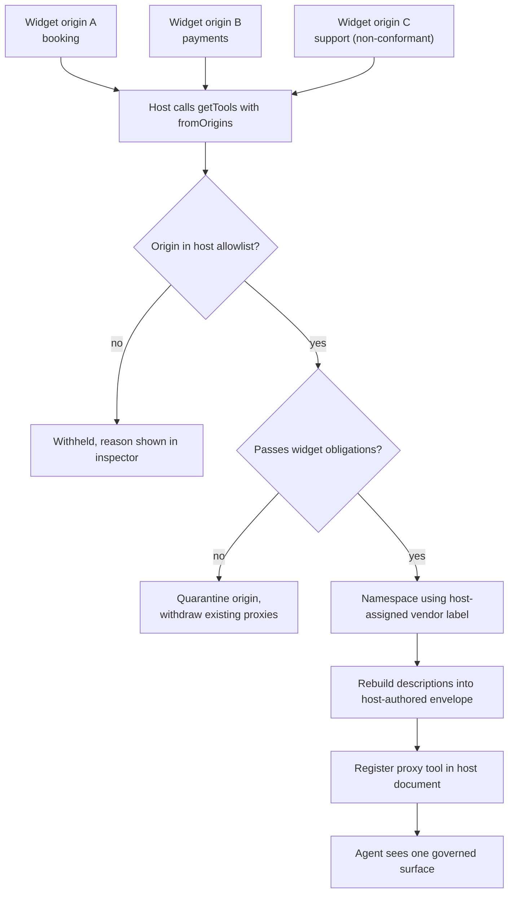

# Ambient - Plan

## Goal Capsule

- **Objective:** Ship a conformance contract for third-party widgets that publish WebMCP tools into a host page they do not own, plus the reference implementation that proves it, as a WebMCP Challenge submission.
- **Product authority:** Tomiwa. Solo builder driving parallel agentic harnesses.
- **Hard deadline:** 2026-09-03, 13:00 PDT (16:00 ET). No extension exists.
- **Open blockers:** None blocking planning. Three empirical unknowns are sequenced as the plan's first unit — see Outstanding Questions.
- **Readiness:** Product Contract complete and research-verified. Implementation Units, Verification Contract, and Definition of Done are not yet written; run `ce-plan` against this file to add them.

---

## Product Contract

### Summary

Ambient defines what a third-party widget must do to be a good citizen in someone else's tool namespace, and what a host page must do to govern the result. It ships as a short conformance contract, a host aggregator, a widget helper, a conformance checker, and a four-origin demo in which a plain page becomes agent-operable by pasting script tags and a misbehaving widget is caught before it reaches the agent.

### Problem Frame

A page assembled from third-party embeds is opaque to an agent. The scheduler, the checkout, and the support widget each hold real capability, and none of it is reachable except through pixel-level computer use, which is brittle and unauditable.

WebMCP supplies the plumbing. A cross-origin iframe granted the `tools` Permissions Policy can register tools, `exposedTo` gates who may call them, and a host retrieves them with `getTools({ fromOrigins })`. What the spec does not supply is any way to make the result coherent or safe.

Within a single document, registering a duplicate tool name rejects with `InvalidStateError`. Across origins there is no handling at all: `getTools()` returns both tools, sorted alphabetically, with no dedup, no rename, and no error. Disambiguation is left entirely to the caller via `RegisteredTool.window` and `RegisteredTool.origin`. No naming convention exists anywhere in the spec or Chrome's documentation — the official examples themselves mix kebab, snake, and camel case. `untrustedContentHint` is defined but carries no normative consumer obligation, so a third-party tool description flows into an agent's context as unmarked, unsanitized text.

The cost lands on whoever assembles the page. A host owner who embeds three vendors inherits three vendors' naming choices, three vendors' descriptions in their agent's context, and no mechanism to refuse any of it short of removing the widget.

### Key Decisions

- **The contract is the product; the code is the reference implementation.** A library that wraps `registerTool` is plumbing the spec may absorb. The rules governing federated naming, provenance, and untrusted content survive any change to the execution mechanism, and they are what a reader recognizes as invention.

- **Provenance is the host's to assign, never the widget's to claim.** The host allowlist maps each admitted origin to its vendor label; a widget may name only the segment beneath it. A widget-declared vendor label is forgeable, and forging it is not merely impersonation: because same-document duplicate names reject with `InvalidStateError`, a hostile widget that claims a trusted vendor's label either receives the agent's calls or silently deletes the legitimate widget's capability from the surface, while passing every other obligation. Origin is the one identifier the browser supplies and nobody can assert.

- **The host proxies rather than passes through.** The aggregator discovers widget tools via `getTools({ fromOrigins })` and registers its own namespaced proxy tools in the host document, forwarding to the originals through `executeTool`. Passthrough would leave the host unable to rename, annotate, or refuse anything.

- **Revocation is enforced at the Permissions Policy, not the proxy layer.** Withdrawing a widget removes `allow="tools <origin>"` and resets the iframe, cutting its ability to register at all. Dropping the proxy alone would leave containment conditional on whether the agent also observes iframe tools directly; removing the grant makes it unconditional.

- **Untrusted text is contained structurally, not only by detection.** Every proxy description is rebuilt by the host from a template carrying explicit provenance and third-party-data delimiters, with pattern detection layered on top. A judge will try to write a description that beats a detector and may succeed; a rebuilt, delimited, provenance-labeled description still holds.

- **`.` is the namespace separator.** Tool names are restricted to ASCII alphanumerics plus `_`, `-`, and `.`, so `/`, `:`, and `@` are unavailable. Of the three permitted characters, `.` is the only one absent from every official Chrome example.

- **The conformance checker is critical path, not a stretch goal.** With work fanned out across parallel agents, the checker is the only mechanism keeping their output composable, and it doubles as the instrument that catches the hostile widget on camera.

- **The demo argues adoption first, containment second.** The hook is a plain page becoming operable by pasting script tags; the payoff is a widget misbehaving and being stopped. Adoption alone reads as convenience.

- **The widget helper carries a third-party origin trial token.** WebMCP's trial supports third-party tokens, and they must be delivered from an external JavaScript file — which is what the helper already is. Adopting Ambient therefore enables WebMCP on any host embedding the widget, turning the vendor-distribution argument from narration into a working mechanism.

### Actors

- A1. **Host site owner** — assembles a page from third-party embeds, pastes the aggregator, and sets which origins may contribute and under what label.
- A2. **Widget vendor** — ships an embeddable widget and adopts the contract so their capability travels with the embed.
- A3. **Visiting agent** — ChatGPT's in-app browser or Chrome with WebMCP enabled; consumes the host's tool surface.
- A4. **End user** — states an outcome and watches it execute on the page.
- A5. **Non-conformant widget** — an embed that misdeclares its behavior, over-collects input, carries instructions in its tool description, impersonates another vendor, or hangs on execution. Adversary, and the demo's second act.

### Requirements

**The conformance contract**

- R1. The contract states obligations for two roles separately: what a widget must do to be federated, and what a host must do to federate safely.
- R2. Each obligation names the failure it prevents, so a reader can tell why the rule exists without reading the implementation.
- R3. The contract is readable end to end in under two minutes.

**Widget obligations**

- R4. A widget declares only its own widget identifier; the vendor label is assigned by the host, so a widget cannot assert who it is.
- R5. A widget restricts `exposedTo` to host origins it has been embedded into, never a wildcard.
- R6. A widget marks every tool returning content it did not author with `untrustedContentHint`.
- R7. A widget declares `readOnlyHint` truthfully; any tool that mutates state, sends a message, or moves money declares itself mutating.
- R8. A widget's input schema accepts only parameters the tool needs, and never a free-form context or passthrough field.
- R9. A widget's tool description states capability only, and carries no instruction directed at the agent.
- R10. A widget notifies its host when its own tool surface changes, so the host need not depend on cross-origin event propagation.

**Host aggregator obligations**

- R11. The aggregator admits tools only from origins the host has allowlisted, and derives each tool's vendor label from that allowlist entry rather than from the widget.
- R12. The aggregator assigns every federated tool a namespaced name of the form `vendor.widget.verb`, within the 128-character limit.
- R13. The aggregator rebuilds every agent-visible string a widget supplies — descriptions, parameter descriptions, enum values, and returned content — into a host-authored envelope carrying the contributing origin and explicit third-party-data delimiters.
- R14. The aggregator additionally detects agent-directed instructions in widget-supplied text and quarantines on a match.
- R15. Quarantine is per-origin and retroactive: a widget failing any obligation contributes no tools, and any proxies already registered for that origin are withdrawn.
- R16. The aggregator re-evaluates every admitted widget on each aggregation pass, so a widget that turns hostile after load is caught.
- R17. The host can revoke a widget's tools without removing the widget from the page, by withdrawing its Permissions Policy grant.
- R18. The aggregator keeps the exposed surface current as widgets register and unregister, and serializes overlapping aggregation passes so a pass triggered by its own proxy registrations cannot recurse.
- R19. The aggregator returns a structured failure envelope, rather than hanging or throwing, when a proxied tool is unavailable, errors, or exceeds a bounded execution timeout.
- R20. Namespaced names are normalized and validated before registration; a name that collides, exceeds the length limit, or carries characters illegal in tool names is rejected rather than truncated or coerced.

**Conformance checker**

- R21. The checker evaluates a widget against every widget obligation and reports pass or fail per rule.
- R22. The checker detects a tool whose declared `readOnlyHint` contradicts its observed behavior.
- R23. The checker detects agent-directed instructions in a tool description.
- R24. The checker runs against all demo widgets as a pre-integration gate, not only as a demo surface.

**Reference demo**

- R25. Four independently deployed origins: one host site and three widget vendors.
- R26. Two widgets register a tool with the same unqualified verb, so collision resolution is observable rather than asserted.
- R27. One widget is non-conformant in a way the checker catches and the aggregator blocks.
- R28. The host page shows which origin supplied each available tool.
- R29. The host page shows per-origin federation status — iframe loaded, origin trial active, `allow` attribute present, tools discovered, tools blocked and why — so a silent failure is distinguishable from a deliberate block.
- R30. The page detects an unsupported browser and explains what is required rather than rendering blank.
- R31. A judge reaches full functionality from the live URL with no installation step.

**Submission artifacts**

- R32. Public repository with an open-source license visible in the About panel.
- R33. Demo video under three minutes, public on YouTube, with audio, opening on the adoption moment.
- R34. Written description that names the specific spec gaps Ambient fills.
- R35. Every origin serves a valid Chrome origin trial token so judges need no browser flag, and the token remains valid through the judging window.

### Federation path

### Key Flows

- F1. **Adoption**
  - **Trigger:** A1 pastes the aggregator script and three widget embeds into a page with no first-party WebMCP code.
  - **Actors:** A1, A2, A3
  - **Steps:** Aggregator discovers tools across allowlisted origins; screens each against the widget obligations; namespaces with host-assigned labels, rebuilds descriptions, registers proxies in the host document; agent's surface populates.
  - **Outcome:** The page is agent-operable without first-party tool code.
  - **Covered by:** R11, R12, R13, R25, R31

- F2. **Collision resolution**
  - **Trigger:** Two allowlisted widgets each register a tool with the same unqualified verb.
  - **Actors:** A2, A3
  - **Steps:** Aggregator derives distinct namespaced names from each origin's allowlist label; both proxies register without an `InvalidStateError`; each carries its origin in its description envelope.
  - **Outcome:** Both capabilities remain reachable and distinguishable.
  - **Covered by:** R11, R12, R20, R26

- F3. **Containment**
  - **Trigger:** A5 ships a tool carrying agent-directed instructions, misdeclares `readOnlyHint`, or claims another vendor's origin label.
  - **Actors:** A5, A1, A3
  - **Steps:** Checker flags the violated obligation; aggregator quarantines the origin and withdraws any proxies already registered for it; inspector shows what was blocked and why; agent's surface never contains it.
  - **Outcome:** The hostile capability does not reach the agent, and the host owner can see it was stopped.
  - **Covered by:** R13, R14, R15, R16, R21, R23, R27

- F4. **Revocation**
  - **Trigger:** A1 disables one widget's tools while leaving the widget on the page.
  - **Actors:** A1, A3
  - **Steps:** Host removes the origin from the allowlist, withdraws its `allow="tools <origin>"` grant and resets the frame; aggregator aborts the affected proxy registrations; agent's surface updates.
  - **Outcome:** Capability is withdrawn without changing page content, and the widget cannot re-register.
  - **Covered by:** R15, R17, R18

- F5. **Degraded federation**
  - **Trigger:** An allowlisted origin fails to load, lacks a valid origin trial token, or returns no tools.
  - **Actors:** A1
  - **Steps:** Aggregator records the per-origin cause; inspector distinguishes not-loaded, no-token, grant-missing, zero-tools, and quarantined; other origins aggregate unaffected.
  - **Outcome:** A silent failure is legible rather than indistinguishable from a deliberate block.
  - **Covered by:** R19, R29, R30

### Acceptance Examples

- AE1. **Covers R12, R26.** Given widget `acme.booking` and widget `zenith.support` each register `search`, when the host aggregates, then both appear to the agent as `acme.booking.search` and `zenith.support.search`, and neither registration rejects.
- AE2. **Covers R4, R11.** Given a widget served from an origin the host labels `zenith` attempts to present itself as `acme`, when the host aggregates, then its tools are namespaced under `zenith` regardless of what the widget declared.
- AE3. **Covers R7, R22.** Given a tool declares `readOnlyHint: true` but writes state during execution, when the checker evaluates it, then the checker fails that widget on the truthful-annotation obligation.
- AE4. **Covers R9, R13, R14, R23.** Given a tool description contains an instruction addressed to the agent, when the aggregator processes it, then the origin is quarantined and the inspector records the violated rule.
- AE5. **Covers R15, R16.** Given a widget passes conformance at load and registers a non-conformant tool later, when the next aggregation pass runs, then the origin is quarantined and its previously registered proxies are withdrawn.
- AE6. **Covers R11, R15.** Given a widget registers tools from an origin the host has not allowlisted, when the agent requests the surface, then those tools are absent and the inspector shows the origin was refused.
- AE7. **Covers R18.** Given an allowlisted widget aborts its registrations mid-session, when the host next aggregates, then the corresponding proxies drop without disturbing other widgets' tools.
- AE8. **Covers R19.** Given the agent calls a proxy whose underlying widget has unloaded or does not resolve within the timeout, when the call is made, then the proxy returns a structured failure envelope naming the cause rather than hanging.
- AE9. **Covers R8.** Given a tool's input schema declares a free-form context parameter, when the checker evaluates it, then the checker fails that widget on the minimal-input obligation.
- AE10. **Covers R20.** Given a composed namespaced name would exceed 128 characters or contain an illegal character, when the aggregator registers it, then registration is refused and the inspector records why, rather than the name being truncated or coerced.

### Success Criteria

- A judge opens the live URL in a supported browser and reaches full functionality with no install step and no browser flag.
- The video shows adoption, collision, and containment inside three minutes, with the adoption moment inside the first forty seconds.
- The checker gates integration: every widget passes before it ships, and the non-conformant one fails on the specific rule it violates.
- A reader who never runs the code can state, from the contract alone, which spec gaps Ambient fills.
- No federation failure during a live demo is indistinguishable from the demo's own containment payoff.

### Scope Boundaries

**Deferred for later**

- Browser-extension build of the aggregator for demonstrating on sites the team does not control. Adds an install step between a judge and the live URL.
- Vendor dashboard, tool versioning, and adoption analytics.
- Package publication as the primary artifact.
- A hosted registry of conformant vendors.

**Outside this product's identity**

- Not a general-purpose MCP client or tool-authoring framework. That ground is occupied by MCP-B and the existing framework bindings.
- Not an agent. Ambient governs a tool surface; it does not reason over one.
- Not a wrapper that retrofits non-cooperating third-party embeds. Cross-origin injection into another vendor's iframe is not possible, and claiming otherwise would misrepresent what the demo shows.

**Designated cuts under deadline pressure**

If the Wednesday freeze arrives with work outstanding, cut in this order: the checker's behavioral-contradiction detection (R22), then the third-party origin trial token. Do not cut the contract, the four origins, or containment.

### Dependencies / Assumptions

Verified against primary sources on 2026-08-31. Items marked UNVERIFIED are the day-one spike.

**Cross-origin federation**

- Federation requires a three-way AND: the host embeds with `allow="tools <origin>"`, the widget registers with `exposedTo: ['https://host']`, and the host calls `getTools({ fromOrigins: [...] })`. If any one is missing the result is an empty tool list with **no error** — which is why R29 exists.
- `exposedTo` is bidirectional: it grants access both when the widget is embedded on that origin and when that origin is embedded in the widget.
- `exposedTo` and `fromOrigins` accept **secure origins only**. Local development needs four distinct HTTPS origins; `localhost` with differing ports will not do.
- A working reference exists: `GoogleChromeLabs/webmcp-tools/demos/page-agent` implements exactly this pattern, including the `iframe.allow = \`tools ${origin}\`` form used when the frame's `src` is dynamic. `WebMCP-org/examples` contains no cross-origin example.
- UNVERIFIED: whether a cross-origin child's registration changes fire `toolchange` in the embedder's document. R18, F4, and AE7 depend on the host learning about child changes; R10's widget-side notification exists so the answer is not load-bearing.
- UNVERIFIED: whether an agent observes cross-origin iframe tools directly alongside the host's proxies. R17's Permissions Policy enforcement is what makes containment unconditional either way.

**Origin trial**

- Trial ID `4163014905550602241`, Chromium trial name `WebMCP`, milestones 149–156. Self-service, `ot_require_approvals: false` — tokens issue immediately, no review queue.
- **Iframes do not inherit the embedder's token.** Each of the four origins needs its own token, delivered by meta tag or `Origin-Trial` header in that origin's own document.
- The trial supports **third-party tokens** (`ot_has_third_party_support: true`). A third-party token must be delivered from an external JavaScript file — not a meta tag, inline script, or header — by creating the meta element at runtime. Third-party registration carries a usage cap (standard limit 0.5% of Chrome page loads); first-party tokens carry none.
- Registration offers a match-all-subdomains option, but **subdomain tokens are not issued for origins on the Public Suffix List**, and `vercel.app` is on that list. Four `*.vercel.app` subdomains therefore need four separate tokens. One custom registrable domain with four subdomains takes a single subdomain-matched token. `netlify.app` and `pages.dev` are likely the same but were not confirmed.
- Judging happens after the 3 Sep deadline, so token validity must extend past the judging window, and tokens minted for production hostnames do not cover preview-deployment hostnames.

**API surface**

- Tool names: `[A-Za-z0-9_.-]`, 1–128 characters, enforced with `InvalidStateError`. `/`, `:`, and `@` are unavailable as separators.
- Same-document duplicate registration rejects rather than overwriting. A revoke-then-restore cycle must observe the abort as complete before re-registering the same name.
- Unregistration is by `AbortController` only; there is no `unregisterTool()`. As of Chrome 153 aborting no longer cancels in-flight executions, so a result arriving after revocation must be dropped rather than forwarded.
- `execute` returns `Promise<any>`, serialized by the UA to a JSON string; `executeTool` resolves to a `DOMString`. A non-serializable return fails the execution with a null result rather than throwing to the callback.
- **Documentation conflict:** the spec types `executeTool`'s input as a WebIDL `object`; Chrome's imperative-API docs pass a JSON string. Ship a runtime adapter that tries one and falls back to the other, rather than choosing at build time — the trial is live and this can move between now and judging.
- `untrustedContentHint` imposes no consumer obligation. Ambient's handling of untrusted text is additive to the spec, not an implementation of it.
- Cross-traversable execution rejects with `UnknownError`; spec issue #227 (open) concerns discovery scope across a browsing context group.
- A `webmcp-polyfill.js` exists in `GoogleChromeLabs/webmcp-tools/demos/shared/` and is a viable fallback if a token fails on demo day.

**Project**

- One builder with parallel agents. Integration risk, not implementation speed, is the binding constraint; the conformance checker is the integration gate.
- No existing codebase. Greenfield.

### Outstanding Questions

**Resolve Before Planning**

- None.

**Deferred to Planning**

- Sequence the cross-origin viability spike as the first unit, before any parallel work begins. It must establish on four real HTTPS origins that permissions-policy delegation, `exposedTo`, and `fromOrigins` compose; settle the `executeTool` input shape; and determine whether `toolchange` propagates across origins.
- Define the fallback if the spike fails: same-site subdomain federation, or same-origin modules simulating vendor boundaries with the limitation stated plainly in the write-up.
- Choose the custom domain and assign each of the four origins to a sponsor platform.
- Choose the host site's domain and the three widget capabilities. Constraint: two must share a plausible verb so F2 is observable, and one must be plausibly hostile.
- Decide the envelope format for rebuilt descriptions and returned content, and the detection patterns layered on top.
- Decide whether the hostile widget is hostile from load or turns hostile mid-demo. Turning hostile live exercises R16 and is stronger on camera.

### Sources / Research

All claims verified against primary sources on 2026-08-31.

| Claim | Source |
|---|---|
| Tool names: 1–128 chars, `[A-Za-z0-9_.-]` only, else `InvalidStateError` | [WebMCP spec, `registerTool`](https://webmachinelearning.github.io/webmcp/) |
| Same-document duplicate name rejects; no overwrite | [WebMCP spec, `registerTool` step 9](https://webmachinelearning.github.io/webmcp/) |
| Cross-origin: `getTools()` returns duplicates sorted by name, no dedup or error | [WebMCP spec, `getTools`](https://webmachinelearning.github.io/webmcp/) |
| `tools` Permissions Policy defaults to `'self'`; cross-origin iframes need `allow` | [WebMCP spec §4.5](https://webmachinelearning.github.io/webmcp/) · [Chrome docs](https://developer.chrome.com/docs/ai/webmcp) |
| `exposedTo` / `fromOrigins` are both required and accept secure origins only | [Chrome imperative API](https://developer.chrome.com/docs/ai/webmcp/imperative-api) |
| Working cross-origin reference implementation | [webmcp-tools `demos/page-agent`](https://github.com/GoogleChromeLabs/webmcp-tools) |
| Iframes do not inherit origin trial access | [Chrome origin trial troubleshooting](https://developer.chrome.com/docs/web-platform/origin-trials) |
| WebMCP trial supports third-party tokens; external JS file only | [Third-party origin trials](https://developer.chrome.com/docs/web-platform/third-party-origin-trials) · [Chrome Status](https://chromestatus.com/features) |
| Subdomain tokens not issued for Public Suffix List origins | [Chrome origin trials guide](https://developer.chrome.com/docs/web-platform/origin-trials) |
| `vercel.app` is on the Public Suffix List | [Vercel KB](https://vercel.com/kb/guide/can-i-set-a-cookie-from-my-vercel-project-subdomain-to-vercel-app) |
| Unregistration via `AbortSignal`; in-flight executions survive as of Chrome 153 | [Chrome imperative API](https://developer.chrome.com/docs/ai/webmcp/imperative-api) |
| `untrustedContentHint` is a hint with no normative consumer obligation | [Chrome tool security](https://developer.chrome.com/docs/ai/webmcp/secure-tools) |
| Spec/Chrome conflict on `executeTool` input: `object` vs JSON string | [Spec IDL](https://webmachinelearning.github.io/webmcp/) vs [Chrome imperative API](https://developer.chrome.com/docs/ai/webmcp/imperative-api) |
| Origin trial from Chrome 149; local flag `chrome://flags/#enable-webmcp-testing` | [Origin trial blog](https://developer.chrome.com/blog/ai-webmcp-origin-trial) |
| No official tool-naming convention exists | Verified absent across spec, Chrome docs, and repo README |

Prior art surveyed for overlap: music composer, Super Mario level generator, Excalidraw, Graphite vector draw, React flight search, and the framework bindings catalogued in [awesome-webmcp](https://github.com/leanMCP/awesome-webmcp). None address federation, naming, or third-party governance.

Challenge terms: [The WebMCP Challenge](https://webmcp.devpost.com/).
